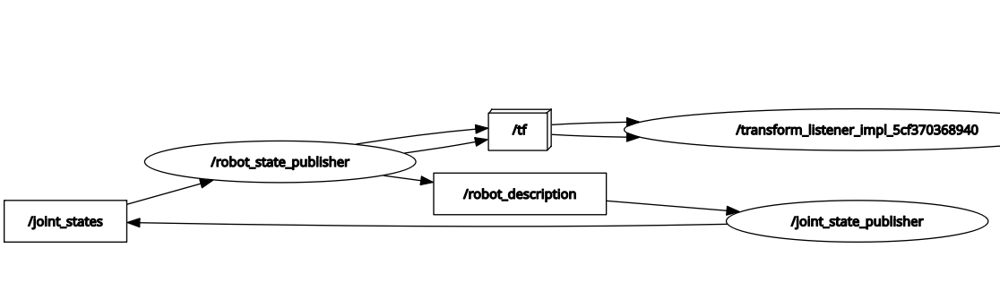

<h1 id="ros2-ile-amr-gelistirme-el-kitabi">ROS2 ile AMR Geliştirme El Kitabı</h1>

---

<h2 id="fihrist">Fihrist</h2>

1. **[Önsöz – Amaç](#hid-1)**

2. **[Konumlama](#hid-2)**  
  2.1 [Temel Kavramlar](#hid-2-1)  
  2.2 [Transform (Frame'ler Arasındaki İlişki)](#hid-2-2)  
  2.3 [Frame Ağacı (TF Tree)](#hid-2-3)

3. **[Modelleme (URDF)](#hid-3)**  
  3.1 [Temel Kavramlar](#hid-3-1)  
  3.2 [Link Anlatısı](#hid-3-2)  
  3.3 [Joint Anlatısı](#hid-3-3)  
  3.4 [URDF Anlatısı](#hid-3-4)  
  3.5 [Modelin ROS2'ye Aktarımı](#hid-3-5)  
  3.6 [Model Örneği](#hid-3-6)  
  3.7 [Xacro Aracı](#hid-3-7)

4. **[Simülasyon (Gazebo)](#hid-4)**  
  4.4 [Temel SDF](#hid-4-1)
  4.1 [ROS bağlantısı](#hid-4-2)  
  4.2 [Pluginler](#hid-4-3)  
  4.3 [Sensörler](#hid-4-4)  

5. **[Haritalama (slam_toolbox)](#hid-5)**   
  5.1 ['slam_toolbox' Çalışma Mantığı](#hid-5-1)  
  5.2 [online-offline, sync-async mantığı](#hid-5-2)  
  5.3 [Parametremeler](#hid-5-3)  
  5.4 [Genel Kullanım](#hid-5-4)

6. **[Navigasyon (nav2)](#hid-6)**  
  6.1 ['nav2' Çalışma Mantığı](#hid-6-1)  
  6.2 [Parametreler](#hid-6-2)  
  6.3 [Genel Kullanım](#hid-6-3)  

7. **[Simülasyon vs Gerçeklik](#hid-7)**  
  7.1 [Benzerlik ve Farklılıklar](#hid-7-1)  
  7.2 [Temel Sistem Tasarımı](#hid-7-2)  
  7.3 [Gereken Matematiksel Hesaplamalar](#hid-7-3)  
  7.4 [Dikkat Edilmesi Gerekenler](#hid-7-4)

<br/>
<br/>
<br/>

<h1 id="hid-1">Önsöz - Amaç</h1>

Bu el kitabı, ROS2 altyapısı kullanılarak otonom mobil robot (AMR) geliştirme sürecini profesyonel ve sistematik bir şekilde öğrenmek isteyen mühendisler, öğrenciler ve araştırmacılar için hazırlanmıştır. Kitap; konumlama, robot modelleme, simülasyon, haritalama ve navigasyon gibi AMR geliştirme sürecinin temel aşamalarını adım adım açıklamayı amaçlar.

Bu dokümanın temel hedefleri:

* AMR geliştirirken ihtiyaç duyulan temel teorik kavramları aktarmak,
* ROS2 ekosisteminin AMR’lerle ilişkili bileşenlerini ayrıntılı biçimde tanıtmak,
* Uygulamaya yönelik, düzenli ve tek kaynaktan takip edilebilir bir referans sunmak,
* Simülasyonda bir AMR'yi tasarlamak ve test etmek,
* Gerçek robot üzerinde kullanılabilecek sağlam bir bilgi temeli oluşturmaktır.

Bu kapsamda, okuyucu kitap ilerledikçe hem kavramsal hem pratik açıdan bir AMR sisteminin nasıl geliştirileceğini öğrenmiş olacaktır.

<br/>
<br/>
<br/>

<h1 id="hid-2">2. Konumlama</h1>

Konumlama (*localization*), bir robotun uzayda hangi pozisyonda ve hangi yönelimde bulunduğunun ölçülmesi ve hesaplanması sürecidir. AMR sistemleri için konumlama, robotun çevresini anlaması ve güvenli şekilde hareket edebilmesi adına kritik bir bileşendir.

Konumlama doğru yapılmadığında:

* Robot harita oluşturamaz,
* Var olan harita üzerinde kendi konumunu bilemez,
* Navigasyon ve çarpışma önleme mekanizmaları düzgün çalışamaz.

ROS2, bu ihtiyacı karşılamak için `tf2` ismindeki güçlü koordinat sistemi yönetim altyapısını sağlar.

<h2 id="hid-2-1">2.1. Temel Kavramlar</h2>

Konumlama sisteminin temelinde iki önemli kavram bulunur: **frame** ve **transform**.

<h3 id="frame-cerceve">Frame (Çerçeve)</h3>

Bir frame, uzayda bir referans noktası ve bu noktanın oryantasyonudur. Her sensör, her robot parçası ve robotun kendisi bir frame ile temsil edilir.

Bir frame şu iki bilgiyi içerir:

* **Pozisyon (position):** x, y, z
* **Oryantasyon (orientation):** x, y, z, w (quaternion)

<h3 id="transform-donusum">Transform (Dönüşüm)</h3>

Transform, iki frame arasındaki göreli konum ve yönelim farkını ifade eder. Yani:

**“A frame’ine göre baktığımızda B frame’i nerededir?”** sorusunun cevabıdır.

Transformların sürekli güncellenmesi sayesinde robot; sensörlerden gelen tüm bilgileri kendi konum ve yönelimine göre anlamlandırabilir.

<h2 id="hid-2-2">2.2. Transform (Frame'ler Arasındaki İlişki)</h2>

Her frame tek başına anlam taşımaz; anlamı diğer frame’lerle olan ilişkisi belirler.

TODO: Aşağıdaki ifadeye uygun bir görsel

Örnek:

```math
B = A + T
```

Burada **T**, A → B dönüşümünü ifade eder. Yani B’nin konumu, A frame’i baz alınarak hesaplanır.

Transformlar sayesinde:

* Bir lidar sensöründen gelen nokta bulutu robot gövdesine göre konumlandırılır,
* Tekerleklerin konumu gövdeye göre belirlenir,
* Haritadaki konum robotun kendi local frame’iyle ilişkilendirilir.

Transformlar zincir hâlinde birbirine bağlanarak tüm sistemde tam bir konumlama tutarlılığı oluşturur.

<h2 id="hid-2-3">2.3. Frame Ağacı (TF Tree)</h2>

ROS2’de tüm frame’ler hiyerarşik bir ağaç yapısı oluşturur. Bu yapıya **TF Tree** denir.

TODO: Bir tf tree görseli tf_toolstan çıkma

Bir frame’in:

* **yalnızca bir ebeveyni**,
* **birden fazla çocuğu** olabilir.

Bu yapı sayesinde robotun herhangi iki frame’i arasındaki konum, doğrudan bağlı olmasalar bile, aradaki zincir takip edilerek hesaplanabilir.

TODO: aşşadaki ifadeye uyfun bir görsel

Örnek hesaplama:

```math
T_{\text{robot→A}} = T_{\text{map→A}} - T_{\text{map→robot}}
```

Bu yöntem, gerçek zamanlı ve tutarlı konumlama için temel altyapıyı sağlar.  

<br/>
<br/>
<br/>

<h1 id="hid-3">3. Modelleme (URDF)</h1>

Robotu simülasyon ortamında veya gerçek dünyada çalıştırabilmek için önce robotun fiziksel yapısının tanımlanması gerekir. ROS2’de robot modelleme için **URDF (Unified Robot Description Format)** kullanılır.

URDF, XML tabanlı bir format olup bir robotun:

* geometrisini,
* eklemlerini,
* kütlesini ve atalet özelliklerini,
* çarpışma modellerini,
* görsel temsilini
  ayrıntılı bir şekilde tanımlamaya imkân verir.

URDF modeli oluşturulduğunda, ROS2 bu modeli otomatik olarak **tf** yapısına dönüştürür:

* Her **link**, bir **frame** olarak,
* Her **joint**, bir **transform** olarak temsil edilir.

<br/>

<h2 id="hid-3-1">3.1. Temel Kavramlar (Link ve Joint)</h2>

URDF iki ana yapı üzerine kuruludur:

<h3 id="link">Link</h3>

Robotun fiziksel parçalarını temsil eder. Gövde, tekerlek, kol segmenti gibi her fiziksel yapı bir link’tir.

TODO: Bi tane link görseli

<h3 id="joint">Joint</h3>

İki link arasındaki mekanik bağı ve hareket ilişkisini tanımlar.

URDF modeli linklerin ve jointlerin bir araya gelmesiyle robotun tam fiziksel yapısını oluşturur.

TODO: Bi tane joint görseli

<br/>

<h2 id="hid-3-2">3.2. Link Anlatısı</h2>

Bir link, üç temel bileşenden oluşur:

<h3 id="visual-tag">1. Visual Tag</h3>

`<visual>` etiketi, bir link’in simülasyon ortamında nasıl görüneceğini tanımlar. Bu bölüm yalnızca görsel temsil içindir; fizik motoru tarafından dikkate alınmaz.

Bir `<visual>` bloğu aşağıdaki alt etiketleri içerir:

* **`<origin>`** → Görsel modelin link’e göre konumu ve oryantasyonu.

  ```xml
  <origin xyz="0 0 0" rpy="0 0 0" />
  ```

* **`<geometry>`** → Görsel modelin şekli veya 3D dosya referansı.
  Kullanım seçenekleri:

  ```xml
  <geometry>
      <box size="1 0.5 0.2" />
      <cylinder radius="0.2" length="1" />
      <sphere radius="0.1" />
      <mesh filename="package://robot_description/meshes/base.dae" scale="1 1 1" />
  </geometry>
  ```

* **`<material>`** → Renk veya doku bilgisi.

  ```xml
  <material name="gray">
      <color rgba="0.5 0.5 0.5 1" />
  </material>
  ```

Bu etiket yalnızca simülasyon ve görselleştirme içindir; çarpışma veya fizik hesaplarını etkilemez.

<h3 id="collision-tag">2. Collision Tag</h3>

`<collision>` etiketi, fizik motorunun çarpışma hesaplamaları için kullandığı modele ait tanımı içerir. Bu geometri mümkün olduğunca basit tutulmalıdır.

Bir `<collision>` bloğunda yer alabilen alt etiketler:

* **`<origin>`** → Çarpışma modelinin link’e göre konumu ve oryantasyonu.

  ```xml
  <origin xyz="0 0 0.05" rpy="0 0 0" />
  ```

* **`<geometry>`** → Çarpışma modelinin geometrisi.

  ```xml
  <geometry>
      <box size="1 0.5 0.2" />
      <!-- veya -->
      <cylinder radius="0.2" length="1" />
      <!-- veya -->
      <sphere radius="0.1" />
      <!-- veya -->
      <mesh filename="package://robot_description/meshes/base_collision.stl"/>
  </geometry>
  ```

>Not: `mesh` kullanılabilir ancak fizik motorunun performansını düşürebilir. Bu nedenle mümkünse *box, sphere, cylinder* gibi basit şekiller önerilir.

<h3 id="inertial-tag">3. Inertial Tag</h3>

`<inertial>` etiketi, link’in fiziksel davranışlarının doğru hesaplanması için gerekli olan kütle ve atalet bilgilerini içerir. Bu bölüm, gerçekçi bir simülasyonun temelini oluşturur.

Bir `<inertial>` bloğunda kullanılabilen alt etiketler:

* **`<origin>`** → Ağırlık merkezinin link’e göre konumu.

  ```xml
  <origin xyz="0 0 0" rpy="0 0 0" />
  ```

* **`<mass>`** → Link’in kütlesi (kg).

  ```xml
  <mass value="1.0" />
  ```

* **`<inertia>`** → Atalet tensörü değerleri.
  Bu değerler 3×3 simetrik inertia matrisinin URDF karşılığıdır.

  ```xml
  <inertia
      ixx="0.02" ixy="0.0" ixz="0.0"
      iyy="0.02" iyz="0.0"
      izz="0.03" />
  ```

Bu değerler yanlış verilirse robot, simülasyonda gerçek dışı şekilde savrulabilir, yalpalayabilir veya fizik motoru kararsız davranabilir. Bu nedenle mümkün olduğunca doğru hesaplanmalı veya CAD yazılımlarından alınmalıdır.

<br/>

<h2 id="hid-3-3">3.3. Joint Anlatısı</h2>

Joint’ler robotun iki linki arasındaki mekanik bağı ve hareket ilişkisini tanımlar. URDF, dört temel joint türü sunar ve her biri belirli bir hareket modeli için tasarlanmıştır.

Her joint tanımı şu temel alt etiketlerden oluşur:

* **`<parent>`** → Üst linki belirtir
* **`<child>`** → Alt linki belirtir
* **`<origin>`** → Joint’in iki link arasındaki konumu ve oryantasyonu
* **`<axis>`** → Hareket ekseni (sadece hareketli jointlerde)
* **`<limit>`** → Hareket sınırları (revolute ve prismatic için)
* **`<dynamics>`** → Sürtünme ve sönüm değerleri (opsiyonel)
* **`<calibration>`**, **`<mimic>`**, **`<safety_controller>`** → Gelişmiş kullanımlarda opsiyonel etiketler

Aşağıda her joint türü ayrıntılı açıklanmıştır:

---

<h3 id="fixed-joint">1. Fixed Joint</h3>

Hiçbir şekilde hareket etmeyen, tamamen sabit eklemdir.

TODO: Her tür için bi tane GIF mi koysak

**Kullanılabilir tagler:**

* `<parent>`
* `<child>`
* `<origin>`

**Örnek:**

```xml
<joint name="lidar_mount" type="fixed">
    <parent link="base_link" />
    <child link="lidar_link" />
    <origin xyz="0 0 0.2" rpy="0 0 0" />
</joint>
```

---

<h3 id="revolute-joint">2. Revolute Joint</h3>

Belirli bir eksende sınırlı dönüş yapabilen eklemdir.

**Ek tagler:**

* `<axis>` → Dönüş ekseni
* `<limit>` → Alt/üst açı sınırı, hız ve efor

**Tüm kullanılabilen tagler:**

* `<parent>`
* `<child>`
* `<origin>`
* `<axis>`
* `<limit>`
* `<dynamics>` *(isteğe bağlı)*
* `<safety_controller>` *(isteğe bağlı)*
* `<calibration>` *(isteğe bağlı)*

**Örnek:**

```xml
<joint name="arm_joint" type="revolute">
    <parent link="arm_base" />
    <child link="arm_link" />
    <origin xyz="0 0 0.1" rpy="0 0 0" />
    <axis xyz="0 0 1" />
    <limit lower="-1.57" upper="1.57" effort="5" velocity="1.0" />
</joint>
```

---

<h3 id="continuous-joint">3. Continuous Joint</h3>

Bir eksende sınırsız dönebilen eklemdir. Tekerlek gibi sürekli dönen parçalarda kullanılır.

**Önemli Not:** `<limit>` etiketi kullanılmaz, çünkü hareket sınırsızdır.

**Kullanılabilir tagler:**

* `<parent>`
* `<child>`
* `<origin>`
* `<axis>`
* `<dynamics>` *(opsiyonel)*

**Örnek:**

```xml
<joint name="left_wheel_joint" type="continuous">
    <parent link="base_link" />
    <child link="left_wheel" />
    <origin xyz="0 0.25 0" rpy="0 0 0" />
    <axis xyz="0 1 0" />
</joint>
```

---

<h3 id="prismatic-joint">4. Prismatic Joint</h3>

Tek eksende doğrusal (lineer) hareket eden eklemdir.

**Ek tagler:**

* `<axis>` → Doğrusal hareket ekseni
* `<limit>` → Minimum/maximum mesafe, hız ve efor

**Kullanılabilir tagler:**

* `<parent>`
* `<child>`
* `<origin>`
* `<axis>`
* `<limit>`
* `<dynamics>` *(opsiyonel)*

**Örnek:**

```xml
<joint name="slider_joint" type="prismatic">
    <parent link="rail" />
    <child link="slider" />
    <origin xyz="0 0 0" rpy="0 0 0" />
    <axis xyz="1 0 0" />
    <limit lower="0.0" upper="0.3" effort="10" velocity="0.5" />
</joint>
```

---

Her joint türü, fizik motorunun robotun hareketini doğru simüle edebilmesi için doğru tag değerlerine ihtiyaç duyar.  

<br/>

<h2 id="hid-3-4">3.4. URDF Anlatısı</h2>

URDF (Unified Robot Description Format), bir robotun fiziksel yapısını ve kinematik ilişkilerini **XML tabanlı** olarak tanımlamamızı sağlayan bir formattır. URDF dosyası, robotun link–joint organizasyonunu, görsel ve fiziksel temsilini içerir ve ROS2 ekosisteminde robotun yapısal tanımını oluşturur.

TODO: Örnek bi tane robot var ya ros2'nin onun linkleri açık halinin fotosunu koy

Her URDF dosyası iki temel unsurla başlar:


#### XML Başlık Tanımı

```xml
<?xml version="1.0"?>
```

Bu ifade, XML dosyasının standart sürüm tanımıdır ve URDF'in teknik olarak geçerli bir XML dokümanı olduğu bilgisini sağlar.

#### `<robot>` Etiketi

URDF’in tüm içeriği bir adet `<robot>` etiketi içerisinde bulunur:

```xml
<robot name="robot_adi">
    <!-- link ve joint tanımlamaları -->
</robot>
```

Bu etiket robotun ROS içerisindeki adını belirler ve URDF dosyasındaki bütün link ve joint tanımlamalarının kapsayıcısıdır.  

<br/>

<h2 id="hid-3-5">3.5 URDF -> ROS2 Bağlantısı</h2>

URDF dosyasının tek başına var olması, robotun ROS2 sistemi tarafından kullanılmasını sağlamaz. Bir URDF modelinin ROS2 grafik yapısında (node–topic–tf yapısında) görünür ve erişilebilir olmasını sağlayan temel mekanizma `robot_state_publisher` düğümüdür.

Bu alt bölümde URDF’in ROS2’ye nasıl “tanıtıldığını” ve hareketli eklemlerin nasıl güncellendiğini teorik düzeyde inceleyeceğiz.

---

### `robot_state_publisher` Nedir?

`robot_state_publisher`, URDF tabanlı robot tanımını ROS2 ekosistemine dahil eden **merkezi düğümdür**. URDF'in ROS2 tarafında anlamlı bir hale gelmesi, TF (transform) ağacının oluşması ve linkler arasındaki dönüşümlerin yayınlanması bu düğüm üzerinden gerçekleşir.



Bu düğümün temel görevleri üç başlık altında özetlenebilir:

#### A) URDF Dosyasını Okumak

Düğüm çalıştırılırken genellikle `robot_description` isimli bir parametre üzerinden URDF modeli verilir.

Düğüm, URDF içerisindeki:

* link isimlerini,
* joint yapılarını,
* hiyerarşik kinematik ilişkileri,

okur ve robotun **matematiksel bir kinematik ağacını** oluşturur.

Bu aşama tamamen statiktir: URDF içeriği, `robot_state_publisher` tarafından bir kez yüklenir ve kinematik yapı belleğe alınır.

#### B) `/joint_states` Verisine Göre TF Transformlarını Güncellemek

ROS2’de robotun eklemlerinin anlık durumu `/joint_states` isimli topic üzerinden temsil edilir. Bu topic tipik olarak her eklem için pozisyon (açı veya doğrusal konum), hız ve benzeri bilgileri içerir.

`robot_state_publisher` bu topic'i sürekli olarak dinler ve eklemlerin son durumuna göre TF ağacındaki transformları günceller. Mekanizma şu şekilde özetlenebilir:

1. `/joint_states` üzerinden eklemlerin anlık durum bilgisi alınır.
2. URDF’te tanımlı joint tipi (revolute, prismatic vb.) ve ekseni yorumlanır.
3. İlgili eklem için ebeveyn–çocuk link çifti belirlenir.
4. Elde edilen eklem konumu kullanılarak bu iki link arasındaki dönüşüm (transform) hesaplanır.
5. Hesaplanan dönüşüm TF ağacına yayınlanır.

Dolayısıyla `robot_state_publisher`, URDF’te tanımlı **statik kinematik yapıyı**, `/joint_states` üzerinden gelen **dinamik eklem durumlarıyla** birleştirerek gerçek zamanlı bir TF ağacı üretir.

#### C) TF Ağacını (Frame Tree) Otomatik Olarak Yayınlamak

URDF’te tanımlı her link, TF dünyasında birer **frame**; her joint ise bu frame’ler arasındaki bir **dönüşüm ilişkisi** olarak düşünülebilir.

`robot_state_publisher`, bu zincirin:

* yapısını,
* matematiksel ilişkilerini,
* eklem durumuna bağlı olarak değişen dönüşümlerini

otomatik olarak TF sistemine yayınlar.

Bu nedenle, ROS2’de bir robotun TF yapısının görünür ve tutarlı olması için `robot_state_publisher` **düğümünün çalışıyor olması zorunludur**.

---

### `joint_state_publisher` Nedir?

`joint_state_publisher` (veya arayüz tabanlı sürümü olan `joint_state_publisher_gui`), jointler'in anlık pozisyon bilgilerini **`/joint_states`** topic’i üzerinden yayınlayan **yardımcı (opsiyonel) bir düğümdür**.

Bu düğüm:

* `robot_state_publisher` için bir **zorunluluk değildir**,
* daha çok **gözlem, test ve görselleştirme** amaçlı kullanılır,
* özellikle Rviz2 üzerinde eklemlerin hareketinin elle sürüklenerek incelenmesi için pratik bir araçtır.

Temel ilişki şu şekilde özetlenebilir:

```text
joint_state_publisher → `/joint_states` yayınlar
robot_state_publisher → `/joint_states`'i dinler → TF dönüşümlerini günceller
```

Gerçek bir robot sisteminde `/joint_states` verisi çoğunlukla:

* tekerlek encoder'larından,
* motor sürücü arayüzlerinden,
* sensör füzyonu veya kontrol düğümlerinden

gelmektedir. Bu durumda `joint_state_publisher` kullanılmaz; onun rolü gerçek sensör ve kontrol düğümleri tarafından üstlenilir.

Eğitim ve simülasyon senaryolarında ise `joint_state_publisher` ve `joint_state_publisher_gui`, gerçek donanım olmadan eklem hareketinin modellenmesi ve TF yapısının gözlemlenmesi için pratik ve yeterli bir çözümdür.  

<br/>

<h2 id="hid-3-6">Modelleme Örneği</h2>

Aşağıda, ROS2 ekosistemine entegre edilebilecek basit bir URDF tanımı örneği sunulmuştur. Bu örnek, iki adet link ve bunları birbirine bağlayan tek bir dönel (revolute) eklem içeren minimal bir robot modelinin nasıl tanımlanacağını göstermektedir. Örnek, görsel temsil ve kinematik yapı arasındaki ilişkinin açık biçimde anlaşılabilmesi amacıyla sade tutulmuştur.

```xml
<?xml version="1.0"?>
<robot name="deneme">

	<!-- Ana gövdeyi temsil eden ilk link -->
	<link name="link1">
		<visual>
			<geometry>
				<box size="0.6 0.4 0.2"/>
			</geometry>
		</visual>
	</link>

	<!-- İkinci yapısal elemanı temsil eden link -->
	<link name="link2">
		<visual>
			<geometry>
				<sphere radius="0.2"/>
			</geometry>
		</visual>
	</link>

	<!-- link1 ve link2 arasındaki dönel eklem tanımı -->
	<joint name="joint_link1_to_link2" type="revolute">
		<parent link="link1"/>
		<child link="link2"/>
		<origin xyz="0 0 0.1" rpy="0 0 0"/>
		<axis xyz="0 0 1"/>
		<limit lower="-1.57" upper="1.57"/>
	</joint>

</robot>
```

Bu model "deneme.urdf" adıyla kaydedildikten sonra ROS2 ortamına aşağıdaki komutla dahil edilebilir:

```bash
ros2 run robot_state_publisher robot_state_publisher robot_desc:=/home/.../deneme.urdf
```

Ardından, Rviz2 arayüzü çalıştırılarak oluşturulan robot modeli görselleştirilebilir:

```bash
rviz2
```

Modelin eklem hareketlerinin gözlemlenebilmesi için ise eklem durumlarını yayınlayan yardımcı arayüz şu şekilde başlatılabilir:

```bash
ros2 run joint_state_publisher joint_state_publisher_gui
```

Bu adımların uygulanmasıyla URDF modeli, ROS2'nin TF yapısı içerisinde dinamik olarak izlenebilir hale gelir.

TODO: Verilen örneğin fotosu mümkünse GIF'i koyalm


<h2 id="hid-3-7">3.7 Xacro Aracı</h2>

URDF dosyaları büyüdükçe tekrar eden bloklar, uzun parametre listeleri ve farklı konfigürasyon ihtiyaçları dosyanın okunabilirliğini azaltır. **Xacro (XML Macros)**, URDF'i makrolar ve değişkenler aracılığıyla modülerleştiren bir ön işlemcidir. Xacro dosyası `.xacro` uzantısıyla yazılır, çalışma zamanında URDF'e dönüştürülür ve `robot_description` parametresi olarak ROS2 düğümlerine aktarılır.

---

### Xacro'nun Sağladığı Temel Özellikler

* **Makro tanımı (`<xacro:macro>`):** Tekrarlayan link/joint bloklarını bir kez yaz, farklı parametrelerle çağır. Parametreler isimli veya varsayılan değerli olabilir.
* **Değişken/parametre (`<xacro:property>`):** Boyut, renk, kütle gibi değerleri merkezi tut; matematiksel ifadelerle hesaplanabilir (örn. `${wheel_d/2.0}`).
* **Koşullu içerik (`if`, `unless`):** Parametreye göre blok ekle/çıkar (`<xacro:if value="${use_lidar}"> ... </xacro:if>`).
* **Döngü benzeri tekrar (`<xacro:macro>` içinde listeleri dönme):** Xacro Python ifadeleri sayesinde liste parametresiyle tekrarlı yapı üretilebilir.
* **Dosya parçalama (`<xacro:include>`):** Büyük modelleri parçalara böl (taban, sensörler, aksesuarlar), gerektikçe dahil et.
* **Komut satırı argümanları:** `xacro file.xacro param:=value` ile dışarıdan değer geçir; launch dosyalarından da parametre besle.
* **İsimlendirme ve namespace:** `${prefix}` kullanarak çoklu robot örneğini çakışmasız üret; `xacro:property` ile string birleştirilebilir.

---

### Makro ve Parametre Örneği

```xml
<!-- Tekerlek makrosu -->
<xacro:macro name="wheel" params="name x y radius width parent">
	<link name="${name}">
		<visual>
			<geometry><cylinder radius="${radius}" length="${width}"/></geometry>
			<origin xyz="0 0 0" rpy="1.5708 0 0"/> <!-- dik silindir -->
		</visual>
		<collision>
			<geometry><cylinder radius="${radius}" length="${width}"/></geometry>
			<origin xyz="0 0 0" rpy="1.5708 0 0"/>
		</collision>
		<inertial>
			<origin xyz="0 0 0" rpy="0 0 0"/>
			<mass value="0.4"/>
			<inertia ixx="0.01" iyy="0.01" izz="0.008" ixy="0" ixz="0" iyz="0"/>
		</inertial>
	</link>
	<joint name="${name}_joint" type="continuous">
		<parent link="${parent}"/>
		<child link="${name}"/>
		<origin xyz="${x} ${y} 0" rpy="0 0 0"/>
		<axis xyz="0 1 0"/>
	</joint>
</xacro:macro>


<!-- Parametreler -->
<xacro:property name="wheel_r" value="0.08"/>
<xacro:property name="wheel_w" value="0.03"/>
<xacro:property name="half_track" value="0.18"/>

<!-- Makro çağrıları -->
<xacro:wheel name="left_wheel"  x="0.0" y="${half_track}"  radius="${wheel_r}" width="${wheel_w}" parent="base_link"/>
<xacro:wheel name="right_wheel" x="0.0" y="-${half_track}" radius="${wheel_r}" width="${wheel_w}" parent="base_link"/>
```
---

### Koşullu Yapı ve Varyant Üretimi

```xml
<xacro:property name="use_lidar" value="true"/>

<xacro:if value="${use_lidar}">
	<link name="lidar_link">
		<visual>
			<geometry><cylinder radius="0.03" length="0.05"/></geometry>
		</visual>
	</link>
	<joint name="lidar_joint" type="fixed">
		<parent link="base_link"/>
		<child link="lidar_link"/>
		<origin xyz="0.15 0 0.25" rpy="0 0 0"/>
	</joint>
</xacro:if>
```

`use_lidar` değerini komut satırında değiştirerek farklı URDF varyantları üretilebilir:

```bash
ros2 run xacro xacro.py robot.urdf.xacro use_lidar:=false -o /tmp/robot_no_lidar.urdf
```

---

### Dosya Parçalama ve Dahil Etme

```xml
<!-- robot.urdf.xacro -->
<robot name="amr" xmlns:xacro="http://ros.org/wiki/xacro">
	<xacro:include filename="$(find robot_description)/urdf/base.xacro"/>
	<xacro:include filename="$(find robot_description)/urdf/sensors.xacro"/>
	<xacro:base prefix="amr_"/>
	<xacro:sensors use_imu:=true use_lidar:=false/>
</robot>
```

Böylece her parça ayrı dosyada bakım görür; yalnızca ilgili dosya düzenlenir.

---

### Komut Satırı ve Launch Kullanımı

* **CLI:** `xacro file.xacro param1:=v1 param2:=v2 -o out.urdf`
* **Launch içi:** `xacro.process_file(path, mappings={"use_lidar": "true"}).toxml()` → `robot_description`
* **Parametre yayma:** Launch argümanları, `xacro` parametrelerine bağlanarak tek launch ile birden çok donanım/simülasyon varyantı üretilebilir.

---

### Önerilen Yaklaşımlar

* Tekrarlayan alt sistemler (tekerlek, lidar montajı, sensör modülü) için makro yaz; yalnızca sayısal parametreleri değiştir.
* Sayısal sabitleri `xacro:property` ile tek bölümde topla; robot varyantlarını bu bölümden yönet.
* Gerçekçi inertial değerleri CAD çıktısından alıp parametre yap; simülasyon-gerçeklik farkını azalt.
* Büyük projelerde taban, sensör, eklenti gibi parçaları ayrı `.xacro` dosyalarına böl ve `<xacro:include>` ile birleştir.
* Çoklu robot örneği üretirken `prefix` veya `robot_name` parametreleriyle frame çakışmasını önle.
* Koşullu blokları (if/unless) az ve okunabilir tut; karmaşık koşullar için değerleri launch tarafında netleştir.

Xacro sayesinde URDF modelleri daha okunabilir, yeniden kullanılabilir ve farklı donanım konfigürasyonlarına hızla uyarlanabilir hale gelir.


<br/>
<br/>
<br/>

<h1 id="hid-4">4. Simülasyon (Gazebo)</h1>

Simülasyon, gerçek dünyadaki olayların, koşulların ve davranışların bilgisayar ortamında taklit edilmesidir. Robotik alanında simülasyon bize çok kritik bir avantaj sağlar:
Robotumuz henüz fiziksel olarak üretilmemiş olsa bile; hareketlerini, sensör okumalarını, çevre ile etkileşimini ve algoritmalarımızın davranışını güvenli şekilde test edebiliriz.

Bu eğitimde simülasyon aracı olarak Gazebo’yu kullanacağız. Gazebo, robotik için geliştirilmiş güçlü bir simülasyon platformudur ve:

* Gerçekçi fizik motorlarına,

* Kolayca modellenebilir dünya ve nesne yapısına,

* ROS2 ile doğal entegrasyona,

* Kameralar, LIDAR’lar, IMU’lar ve daha birçok sensörün simülasyonuna,

* Robot davranışını genişleten plugin sistemine

sahiptir.

#### **Gazebo Classic ve Gazebo Sim Ayrımı**

Gazebo’ya yeni başlayanların sıkça kafasını karıştıran önemli bir nokta vardır:
**Gazebo Classic** ve **Gazebo Sim** ayrımı.

Bu iki isim, aslında Gazebo’nun iki farklı neslini temsil eder:

* **Gazebo Classic**, uzun yıllar kullanılmış olan eski nesil Gazebo’dur. Hâlâ bazı projelerde bulunabilir fakat aktif olarak geliştirilmektedir diyemeyiz.

* **Gazebo Sim (Ignition Gazebo)** ise Gazebo’nun modern, yeniden tasarlanmış halidir. Daha güçlü bir altyapı, daha modüler bir mimari, daha gelişmiş fizik motorları ve ROS2 ile daha temiz bir entegrasyon sunar.

Kısacası:  
***Gazebo Classic geçmiş nesildir. Gazebo Sim yeni nesildir ve geleceği temsil eder.***

Bu eğitim boyunca, güncel ROS2 ekosisteminin doğal devamı olduğu için Gazebo Sim hattında ilerleyeceğiz.

---

### Kaynaklar

Gazebo Sim kullanırken en çok başvuracağımız resmi kaynaklar şunlardır:

* **Gazebo Resmi Dokümantasyonu:**  
Modern Gazebo’nun tüm sürümleri, API referansları, örnekler, plugin kılavuzları ve dünya dosyası formatı detayları burada bulunur.
[https://gazebosim.org/docs](https://gazebosim.org/docs)  

* **Gazebo Uygulaması (Gazebo App)**  
Tarayıcı üzerinden çalışan Gazebo arayüzü. Modelleri, dünyaları ve asset’leri incelemek için idealdir. Diğer geliştiriciler tarafından açık kaynak olarak sunulmuş bir çok modeli, dünyayı buradan inceleyip indirebiliriz.
[https://app.gazebosim.org](https://app.gazebosim.org)  

* **Gazebo Github Reposu**  
Gazebo Sim’in tüm kaynak kodu, paketleri, örnekleri ve issue takibi buradadır. Geliştiriciler için temel başvuru noktasıdır.
[https://github.com/gazebosim](https://github.com/gazebosim)  

---

### **Kurulum**

Aşağıdaki komutlar, Ubuntu 24.04 ve ROS2 Jazzy içindir. [https://gazebosim.org/docs](https://gazebosim.org/docs) linkinden erişilmiştir. Farklı sürümler için kuruluma siz de bu linkten bakabilirsiniz.

#### **1. Gerekli araçları yükleyelim**

```bash
sudo apt update
sudo apt install curl lsb-release gnupg
```  

#### **2. Gazebo paket deposunu ekleyelim:**

```bash
sudo curl https://packages.osrfoundation.org/gazebo.gpg --output /usr/share/keyrings/pkgs-osrf-archive-keyring.gpg
echo "deb [arch=$(dpkg --print-architecture) signed-by=/usr/share/keyrings/pkgs-osrf-archive-keyring.gpg] https://packages.osrfoundation.org/gazebo/ubuntu-stable $(lsb_release -cs) main" | sudo tee /etc/apt/sources.list.d/gazebo-stable.list > /dev/null
```

#### **3. Gazebo Sim’i kuralım:**

```bash
sudo apt update
sudo apt install gz-sim
```

#### **4. Kurulumun doğrulanması:**

```bash
gz sim
```

Karşınıza çıkan varsayılan dünyalardan birini seçerek programı deneyebilirsiniz.  

<br/>

<h2 id="hid-4-1">4.1 ROS Bağlantısı</h2>

Gazebo Sim, **Gazebo Transport** adında, ROS2 ile **doğrudan uyumlu olmayan** kendine ait bir iletişim altyapısı kullanır. Bu yapı topic, service ve component tabanlı mesajlaşma sunar ve ROS2'ye benzer; ancak **DDS tabanlı ROS2 iletişimiyle aynı değildir** ve doğal olarak birbirleriyle konuşamazlar.

Örneğin Gazebo’daki bir sensör, mesela bir kamera:

* Gazebo’nun kendi iletişim kanallarında bir **Gazebo topic’i** üzerinden veri yayınlar,
* fakat bu veri ROS2 tarafında kendiliğinden görünmez.

Bu nedenle Gazebo ile ROS2 arasındaki veri akışı için köprüleme yapan özel entegrasyon paketlerine ihtiyaç duyarız.

Sonuç olarak:

* Gazebo Sim kendi sisteminde çalışır,
* ROS2 kendi DDS tabanlı altyapısını kullanır,
* **İki dünya arasındaki tüm veri akışı yalnızca köprü üzerinden gerçekleşir.**

Bu anlatıda `ros_gz_sim` ve `ros_gz_bridge` paketlerine odaklanacağız.

---

### 1. `ros_gz_sim`

`ros_gz_sim`, Gazebo’nun başlatılması, dünya yönetimi, varlık (entity) oluşturma/kaldırma gibi pek çok işlemi ROS2 üzerinden yapabilmemizi sağlayan **geniş bir araç koleksiyonudur**.

Bu eğitim kapsamında `run` ve `create` araçlarını aktif olarak kullanacağız.

### `run`

`run` executable’ı, Gazebo Sim’i ROS2 tarafından başlatmak için kullanılan temel araçtır.

Normalde terminalde:

```bash
gz sim my_world.sdf
```

komutu ile başlattığınız simülasyon, ROS tarafında bu araç ile başlatılır.

#### `run` ne yapar?

* Bir **world dosyasını (SDF)** yükleyerek Gazebo Sim’i başlatır.
* Arkaplanda ekstra bir kontrol mantığı çalıştırmaz; **Gazebo’nun kendi simülasyon motorunu** ayağa kaldırır.
* Gazebo’nun CLI’siyle benzer şekilde dünyayı başlatır; ancak bunu bir **ROS2 düğümü olarak** yaptığı için:

  * rqt_graph’ta görünebilir,
  * launch dosyalarına doğal şekilde entegre olur.

#### Örnek kullanım

```python
Node(
    package='ros_gz_sim',
    executable='run',
    output='screen',
    arguments=['-r', os.path.join(pkg_share, 'worlds', 'my_world.sdf')],
),
```

### `create`

`create` executable’ı, ROS2 tarafındaki `robot_description` parametresini alarak robotun simülasyonda görünür hâle gelmesini sağlar:

* URDF → SDF dönüşümünü Gazebo’nun dahili dönüştürücüsü ile yapar,
* Gazebo’nun entity oluşturma servisine (`/world/<world_name>/create`) bir istek gönderir,
* Gerisini Gazebo üstlenir.

> Yani `create`, kendi içinde özel bir “spawn algoritması” çalıştırmaz; yaptığı şey Gazebo’nun ilgili servisine doğru formatta istek göndermektir.

#### Örnek kullanım

```python
Node(
    package='ros_gz_sim',
    executable='create',
    parameters=[{'topic': 'robot_description'}],
),
```
---

### `ros_gz_sim` Paketindeki Diğer Araçlar

Aşağıdaki araçlar bu eğitimde doğrudan kullanılmayacak olsa da bilmekte fayda vardır:

| Araç / Executable | Görevi (Kısa Tanım) |
|-|-|
| **factory** | SDF/URDF tabanlı yeni bir varlığı sahneye ekler (alternatif spawn metodu). |
| **remove** | Sahnedeki bir varlığı kaldırır. |
| **reset** | Dünyayı veya simülasyonu çeşitli modlarda resetler. |
| **log** | Log kaydı başlatma/durdurma işlemleri. |
| **gz_sim** | Gazebo’nun kendi çalıştırıcısının ROS tarafından çağrılabilen düşük seviyeli varyasyonu; gelişmiş bazı kullanım senaryolarında tercih edilir. |

#### Kurulum

```bash
sudo apt install ros-${ROS_DISTRO}-ros-gz
```

### 2. `ros_gz_bridge`

Gazebo ile ROS2 arasındaki veri alışverişini sağlayan köprü mekanizmasını `ros_gz_bridge` paketinin `parameter_bridge` executable’ı yönetir.

`parameter_bridge`, YAML dosyasında tanımlanan eşleşmelere göre:

* Gazebo → ROS2
* ROS2 → Gazebo
* Çift yönlü

veri çevirimi yapar.

Büyük projelerde tek tek komut yazmak yerine **YAML dosyasıyla toplu eşleştirme yapmak**, yönetimi çok kolaylaştırır.

#### Örnek YAML Dosyası

```yaml
# - ros_topic_name: "<ROS tarafındaki topic ismi>"
#   gz_topic_name: "<Gazebo tarafındaki topic ismi>"
#   ros_type_name: "<verinin ROS tarafındaki tipi>"
#   gz_type_name: "<verinin Gazebo tarafındaki tipi>"
#   direction: <köprünün yönü>

- ros_topic_name: "cmd_vel"
  gz_topic_name: "iyamr/cmd_vel"
  ros_type_name: "geometry_msgs/msg/Twist"
  gz_type_name: "gz.msgs.Twist"
  direction: ROS_TO_GZ
```

#### Örnek kullanım

```python
Node(
    package='ros_gz_bridge',
    executable='parameter_bridge',
    parameters=[{'config_file': "<dosya_yolu>"}],
),
```

#### Kurulum

```bash
sudo apt install ros-${ROS_DISTRO}-ros-gz-bridge
```  

<br/>

<h2 id="hid-4-2">4.2 Plugin Anlatısı</h2>

Gazebo’da *plugin*, simülasyon ortamındaki bir modelin, sensörün veya dünya bileşeninin davranışını tanımlayan, C++ ile yazılmış bir yazılım modülüdür. Tek başına bir model sadece geometri, kütle ve bağlantılardan ibarettir; hareket etmez, sensör üretmez, kontrol edilemez. İşte plugin’ler bu boşluğu doldurur ve simülasyona “davranış” kazandırır.

Bir plugin:

* Bir modele hareket yeteneği ekleyebilir (örn. diferansiyel sürüş, eklem kontrolü).
* Sensör verisi üretebilir (örn. LIDAR, kamera, IMU).
* Simülasyon dünyası üzerinde etki oluşturabilir (örn. yerçekimi değiştirme, ışık kontrolü).

Kısacası plugin’ler, **Gazebo’da gerçek bir robot davranışının oluşmasını sağlayan temel mekanizmalardır**. Robotun tekerleklerini döndürmesi, kameranın görüntü yayınlaması, IMU’nun gürültülü veri üretmesi veya bir manipülatörün PID ile çalışması gibi tüm işlevler uygun plugin eklenerek elde edilir.

Plugin’ler SDF dosyasında ilgili modele şu şekilde eklenir:

```xml
<plugin
	name="plugin_adi"
	filename="libplugin_kutuphanesi.so"
>

	<!-- Plugin parametreleri buraya gelir -->
</plugin>
```

Gazebo, modeli yüklerken ilgili `.so` dosyasını belleğe alır ve plugin’in çalışma döngüsünü simülasyonun döngüsüne bağlar. Böylece model statik bir tanım olmaktan çıkar, davranış üretebilen bir robot hâline gelir.

### Plugin Türleri

* **Model Plugin**: Robot veya herhangi bir nesnenin davranışını kontrol eder.
* **Sensor Plugin**: Sensör verisinin nasıl üretileceğini belirler.
* **World Plugin**: Dünya ölçeğinde değişiklik veya kontrol sağlar.
* **System Plugin**: Simülasyon başlarken yüklenen, daha genel amaçlı bileşenlerdir.

Bu ayrım kullanıcı için genellikle kritik olmasa da, plugin’lerin hangi seviyede çalıştığını anlamak açısından önemlidir.

---

### AMR İçin Gereken Pluginler

Modern bir AMR’ın Gazebo ortamında işlevsel olabilmesi için, robotun fiziksel davranışlarını ve ROS2 tarafındaki temel veri akışını doğru şekilde simüle etmek gerekir. Bu amaçla bazı kritik plugin’ler kullanılır. Aşağıdaki başlıklar, tipik bir diferansiyel tahrikli mobil robotun ihtiyaç duyduğu temel plugin’leri özetlemektedir.


#### **Joint State Publisher**

Gerçek robotlarda eklemlerin (joint) anlık açı, hız ve pozisyon bilgileri robotun gömülü sistemlerinden alınır.
Simülasyonda ise bu bilgileri üreten taraf bir **joint state plugin’idir**.

Bu plugin:

* Robotun tüm eklemlerinin durumunu okur,
* Bu verileri belirtilen topic üzerinden yayınlar,
* Bu veriler ROS2 tarafında `robot_state_publisher` tarafından kullanılarak TF ağacındaki tüm transformların güncel tutulmasını sağlar.

Bir AMR’ın TF yapısının doğru işlemesi ve RViz gibi araçlarda doğru şekilde görünmesi için bu plugin zorunludur.

##### **Örnek**

```xml
<plugin 
	filename="gz-sim-joint-state-publisher-system"
	name="gz::sim::systems::JointStatePublisher"
>
	<!-- Sadece belirli jointler yayınlansın istiyorsan -->
	<joint_name>joint1</joint_name>
	<joint_name>joint2</joint_name>

	<!-- Tüm jointler yayınlansın istiyorsan hiç joint_name tag'i açma -->

	<!-- Yayınlanacak topic ismi -->
	<topic>robot1/joint_states</topic>
</plugin>
```

---

#### **Odometry Publisher**

Odometri, bir mobil robotun pozisyon ve yönelim bilgisinin tekerlek hareketlerinden tahmini olarak hesaplanmasıdır.

Simülasyonda odometri verisini üreten plugin:

* Tekerleklerin açısal hareketini takip eder,
* Bu hareketten robotun lineer ve açısal hızlarını hesaplar,
* Belirtilen topic üzerinden yayın yapar,

Bu plugin, SLAM, navigasyon ve hız kontrol döngüleri için temel konum geri bildirimi sağlar. Simülasyonda odometri olmazsa nav2 veya slam_toolbox gibi sistemler çalışamaz.

##### **Örnek**

```xml
<plugin
	filename="gz-sim-odometry-publisher-system"
	name="gz::sim::systems::OdometryPublisher"
>
	<!-- Odometry'nin yayımlanacağı topic -->
	<odom_topic>btkamr/odom</odom_topic>

	<!-- Odometry frame'in ismi -->
	<odom_frame>odom_frame</odom_frame>
	
	<!-- Odom frame'in yapışacağı frame-->
	<robot_base_frame>base_footprint</robot_base_frame>

	<!-- Yayım sıklığı -->
	<odom_publish_frequency>10</odom_publish_frequency>
</plugin>
```

---

#### **Differential Drive System**

Çoğu AMR diferansiyel tahriklidir (iki tahrik tekeri + bir caster) biz de bunun üzerinden ilerliyeceğiz.
Gazebo’da bu hareket modelini taklit eden bileşen **differential drive plugin** olarak geçer.

Bu plugin:

* Gelen hız komutlarını belirtilen topic'ten alır,
* Bu komutları sol ve sağ teker hızlarına dönüştürür,
* Tekerlekleri fizik motorunda gerçekçi şekilde döndürür,
* Robotun simülasyon içinde gerçekten hareket etmesini sağlar.

##### **Örnek**

```xml
<plugin
	filename="gz-sim-diff-drive-system"
	name="gz::sim::systems::DiffDrive"
>

	<!-- Hız emirlerinin alınacağı topic -->
	<topic>btkamr/cmd_vel</topic>

	<!-- Sol teker jointi -->
	<left_joint>wheel_left_joint</left_joint>
	
	<!-- Sağ teker jointi -->
	<right_joint>wheel_right_joint</right_joint>

	<!-- Tahrik tekerlekleri arasındaki mesafe -->
	<wheel_separation>0.15</wheel_separation>

	<!-- Teker yarıçapı -->
	<wheel_radius>0.05</wheel_radius>

</plugin>
```

---

#### **Özet**

Bu üç plugin birlikte bir AMR’ın Gazebo simülasyonda “gerçek robot gibi” çalışmasını sağlar:

* **Joint State Publisher** → TF ve eklem durumları
* **Odometry Publisher** → Konum ve hız tahmini
* **Differential Drive System** → Hareket kontrolü  

> Unutmayın, bu eklentiler Gazebo’nun kendi iç eklentileridir; yani Gazebo'nun dahili mesajlaşma sistemini kullanırlar. ROS üzerinden kullanmak için bir köprü (bridge) gereklidir.

> Ayrıca URDF dosyanıza bu pluginleri eklerken, ilgili tanımları mutlaka `<gazebo>` etiketleri içinde vermelisiniz.

> Diğer pluginler için [gazebonun github reposuna](https://github.com/gazebosim/gz-sim/tree/gz-sim8) göz atın "src/systems" altında tüm pluginler mevcut. İstediğiniz pluginin klasörüne girin ve header dosyasında kullanım ile ilgili detayları göreceksiniz. 

<br/>	

<h2 id="hid-4-3">4.3 Sensörler</h2>  

Sensör, fiziksel bir olayı tespit etmek amacıyla bir çıkış sinyali üreten cihazdır. Basitçe, çevrelerindeki bir özelliği (örneğin ışığı, sıcaklığı, nem oranını, hareketi veya ses seviyesini) ölçen ve bu özellikleri genellikle bir elektrik sinyali haline getiren cihaz olarak tanımlanabilir.

Gerçek robotlar çevrelerini sensörlerle algılar; Gazebo Sim’de de sensörlerin veri üretebilmesi için yalnızca SDF sensör tanımı yeterli değildir. Sensör verilerinin simülasyonda işlenmesi için mutlaka **sensör sistem plugin’lerinin** de etkin olması gerekir.

Bu nedenle Gazebo’nun sensör mimarisi iki bileşen üzerinden çalışır:

#### **1) Sensör Donanımı (SDF `<sensor>` Tanımı)**

Bu tanım, sensörün fiziksel ve teknik özelliklerini belirler:

* Kamera çözünürlüğü
* LIDAR ışın sayısı
* IMU güncelleme hızı

Donanımın geometrik ve konfigürasyonel tarafıdır.
**Tek başına veri üretmez.**

#### **2) Sensör Sistem Plugin’i (World Seviyesinde)**

Sensörlerin çalışabilmesi için gerekli yürütücü altyapıdır. Görevleri:

* Sensörlerin güncelleme zamanlamasını yönetmek
* Kamera render sürecini işlemek
* LIDAR raytracing hesaplarını yürütmek
* Sensörlerin veri üretimini başlatmak

Bu plugin **dünya dosyasına eklenmediyse hiçbir sensör çalışmaz.**

---

### 4.3.1 Gazebo’daki Sensör Sistemleri

Gazebo Sim iki tip sensör sistemine sahiptir.

#### **A) Genel Sensör Sistemi — `gz-sim-sensors-system`**

Bu sistem, tüm temel sensörlerin çalışmasını sağlayan çekirdek bileşendir.

```xml
<!-- Genel sensör sistemi: Tüm sensörlerin temel çalışma altyapısını sağlar -->
<plugin filename="gz-sim-sensors-system"
        name="gz::sim::systems::Sensors">

  <!-- Kamera ve GPU lidar gibi sensörler için render motoru.
       Ogre2 çoğu modern simülasyon için önerilir. -->
  <render_engine>ogre2</render_engine>
</plugin>
```

Bu sistem:

* Kamera görüntüsünü üretir
* GPU LIDAR hesaplamalarını yürütür
* Depth kamera, sonar vb. sensörleri işletir

Her dünya dosyasında **en az bir adet bulunması zorunludur**.

#### **B) Sensöre Özel Sistem Plugin’leri**

Bazı sensörlerin fizik tabanlı hesaplamaları daha karmaşıktır.
Bu sensörler için genel sisteme ek olarak **özel bir plugin** gerekir.

Örnekler:

* **IMU** için: `gz-sim-imu-system`
* **Altimeter** için: `gz-sim-altimeter-system`
* **Air Pressure** için: `gz-sim-air_pressure-system`

Kamera, LIDAR ve sonar gibi sensörler ise genel sistem içinde tamamen implemente edildikleri için ek plugin gerektirmezler.

---

### 4.3.2 Yaygın Sensörler Kullanım Örnekleri

Aşağıda, sık kullanılan sensörlerin neden özel plugin gerektirdiği veya gerekmediği anlaşılır şekilde açıklanmıştır.

#### **LIDAR (gpu_lidar / ray)**

LIDAR, çevreyi ışın göndererek algılar. Gazebo Sim’de LIDAR’ın tüm ışın izleme (raytracing) hesaplamaları doğrudan **genel sensör sistemi tarafından** yürütülür.
Bu nedenle LIDAR için ek bir sistem plugin’i gerekmez.

Yapılması gereken tek şey:

* Dünya dosyasına **genel sensör sistemini** eklemek
* Modele `<sensor type="gpu_lidar">` tanımı eklemek

```xml
<sensor name="gpu_lidar" type="gpu_lidar">
  <!-- Sensörün modele göre konumu -->
  <pose>0 0 0 0 0 0</pose>

  <!-- Yayınlanacak ROS/Gazebo topic adı -->
  <topic>lidar/scan</topic>

  <!-- Saniyede 10 kez ölçüm üret -->
  <update_rate>10</update_rate>

  <!-- GPU tabanlı ray sensor yapılandırması -->
  <ray>
    <scan>
      <horizontal>
        <!-- Kaç adet ışın gönderileceği -->
        <samples>640</samples>

        <!-- Işın çözünürlüğü (1 = birebir, 2 = her 2 ışında 1 hesaplama) -->
        <resolution>1</resolution>

        <!-- Taramanın sol sınırı -->
        <min_angle>-1.57</min_angle>

        <!-- Taramanın sağ sınırı -->
        <max_angle>1.57</max_angle>
      </horizontal>
    </scan>

    <!-- Mesafe ölçüm parametreleri -->
    <range>
      <!-- Sensörün minimum algılama mesafesi -->
      <min>0.08</min>

      <!-- Maksimum algılama mesafesi -->
      <max>15.0</max>

      <!-- Mesafe çözünürlüğü -->
      <resolution>0.01</resolution>
    </range>
  </ray>

  <!-- Veriyi kaydedilebilir hâle getirmek için -->
  <always_on>true</always_on>

  <!-- Gazebo GUI’de lazer tarama çizgilerini göster -->
  <visualize>true</visualize>
</sensor>
```

**Özet:**
LIDAR → *yalnızca genel sensör sistemiyle çalışır; ek plugin istemez.*

#### **IMU**

IMU; ivme, açısal hız ve yönelim gibi fiziksel büyüklükleri hesaplar. Bu hesaplamalar fizik motorundan daha derin veri gerektirdiği için Gazebo Sim bunun için ayrı bir yürütücü sağlar.

Bu nedenle IMU’nun çalışması için **iki plugin gereklidir**:

1. *Genel sensör sistemi*
2. *IMU’ya özel sistem plugin’i → `gz-sim-imu-system`*

World içine:

```xml
<!-- Genel sensör sistemi (Her sensör için zorunlu) -->
<plugin filename="gz-sim-sensors-system"
        name="gz::sim::systems::Sensors"/>

<!-- IMU için gerekli fiziksel hesaplama sistemi -->
<plugin filename="gz-sim-imu-system"
        name="gz::sim::systems::Imu"/>
```

Model içine:

```xml
<sensor name="imu_sensor" type="imu">
  <!-- Sensör sürekli açık kalsın -->
  <always_on>true</always_on>

  <!-- 100 Hz IMU çıktısı (gerçek robotlarla uyumlu tipik değer) -->
  <update_rate>100</update_rate>

  <!-- Yayınlanacak IMU topic adı -->
  <topic>imu/data</topic>

  <!-- Görsel temsil (GUI'de küçük bir eksen gösterir) -->
  <visualize>true</visualize>

  <!-- Gürültü modelleme (opsiyonel fakat tavsiye edilir) -->
  <imu>
    <angular_velocity>
      <x>
        <!-- IMU gyro gürültüsü -->
        <noise type="gaussian">
          <mean>0</mean>
          <stddev>0.001</stddev>
        </noise>
      </x>
    </angular_velocity>
    <linear_acceleration>
      <x>
        <!-- IMU ivme gürültüsü -->
        <noise type="gaussian">
          <mean>0</mean>
          <stddev>0.02</stddev>
        </noise>
      </x>
    </linear_acceleration>
  </imu>
</sensor>
```

**Özet:**
IMU → *genel sistem + IMU özel plugin’i gerektirir.*

#### **Kamera (RGB, Depth, Stereo)**

Kameraların görüntü üretmesi için gerekli render pipeline’ı (rastırlama, ışık hesaplamaları, GPU işlemleri) zaten tamamen **genel sensör sisteminin içinde** tanımlanmıştır.

Bu nedenle hiçbir kamera türü için ek plugin gerekmez.

```xml
<sensor name="front_camera" type="camera">
  <!-- Saniyede 30 FPS üret -->
  <update_rate>30</update_rate>

  <!-- Kameranın modele göre konumu -->
  <pose>0.1 0 0.2 0 0 0</pose>

  <!-- Görüntü yayın topic'i -->
  <topic>camera/image_raw</topic>

  <camera>
    <!-- Kamera yatay görüş açısı (radyan cinsinden) -->
    <horizontal_fov>1.047</horizontal_fov> <!-- ~60 derece -->

    <!-- Görüntü çözünürlüğü -->
    <image>
      <width>1280</width>
      <height>720</height>
      <format>R8G8B8</format>
    </image>

    <!-- Lens ayarları (opsiyonel) -->
    <lens>
      <type>pinhole</type>
    </lens>

    <!-- Depth kamera ise bu bölüm eklenebilir:
    <output>depth</output> -->
  </camera>

  <!-- Kameranın render edilmesini etkinleştir -->
  <always_on>true</always_on>
  <visualize>true</visualize>
</sensor>
```

**Özet:**
Kamera → *yalnızca genel sensör sistemi yeterlidir.*

> Genel kural olarak:
>* **Basit sensörler**
  (kamera, LIDAR, sonar)
  → *Sadece genel sensör sistemi yeterlidir.*
>* **Fiziksel hesap gerektiren sensörler**
  (IMU, altimeter, air pressure)
  → *Genel sistem + o sensöre özel sistem plugin’i gerekir.*

<br/>

<h2 id="hid-4-4">Temel SDF</h2>  

<br/>
<br/>
<br/>

<h1 id="hid-5">Haritalama (slam_toolbox)</h1>  

<br/>
<br/>
<br/>

<h1 id="hid-6">Navigasyon (nav2)</h1>  

<br/>
<br/>
<br/>

<h1 id="hid-7">7. Simülasyon vs Gerçeklik</h1>

Simülasyon, gerçekliğin bir taklididir ve gerçeklikle ne kadar benzeşiyorsa o kadar değerlidir. Peki, gerçek dururken neden simülasyon kullanıyoruz? Çünkü gerçeklik hem maliyet hem de emek açısından oldukça zahmetlidir. Üstelik gerçek donanım devreye girdiğinde, hesaplanması güç hatalar ve projeye özgü beklenmedik durumlar kaçınılmaz hâle gelir. Bu nedenle önce simülasyon ortamında çalışmak büyük önem taşır.

Buraya kadar diferansiyel sürüşe sahip bir otonom robotu simülasyonda nasıl oluşturacağımızı öğrendik. Şimdi ise işin gerçek kısmına geçelim.

<br/>

<h2 id="hid-7-1">7.1. Benzerlikler ve Farklılıklar</h2>

ROS2 ile bu zamana kadar işlediğimiz AMR aslında gerçekte de çok farklı çalışmıyor. Zaten bunun için simülasyon kıymetli. Üst sistem için hiç bir kod değişmiyor mesela. Yine aynı mesajları aynı şekilde göndereceğiz, aynı robot modelini kullanacağız.  

Peki değişen şeyler? Bizim doğrudan muhattap olmadığımız bunun yerine simülasyonun bizim için hallettiği şeylerdir. Bunlar ise çoğunlukla alt sistemin işidir (alt sistem - üst sistem muhabbetine [Temel Sistem Tasarımı](#hid-7-2) kısmında değineceğiz.). Öncelikle hareket. Biz robotun hareketini kontrol etmek istediğimizde sadece bir ROS2 Twist mesajı gönderiyoruz ve eklediğimiz plugin sayesinde sihirli bir şekilde simülasyon bizim için hallediyor. İşte simülasyonun hallettiği bu işi biz gerçek hayatta halletmek zorundayız. Bu hız mesajını yakalayıp robotun motorlarını emire göre çalıştırmalıyız. Yani girdimiz Twist türünde bir mesajken çıktımız gerçek hayatta elektriksel güç ayarlaması olmalıdır (Tabi robotumuz elektrikli motorla hareket ediyorsa.). Bir diğeri konum hesaplaması. Bir plugin sayesinde simülasyon yine sihirli bir şekilde bize robotun uzayda ne kadar yol aldığını bize veriyordu. Bunun sayesinde biz de `tf` dönüşümlerine uyguluyorduk. Böylece konumlanma sağlanıyordu. Gerçek hayatta bunu da bizim yapmamız gerekiyor. Bir de sensör sürücülerimiz var. **LiDAR** sensörümüzü gerçek hayatta kullanabilmemiz için bir şekilde bilgisayara tanıtmamız ve ondan aldığımız verileri ROS2 LaserScan mesajına dönüştürmemiz gerekiyor. Temel bir AMR için bu farklar ve yapılacak işler vardık ancak projenize göre işler artabilir. Örneğin kameranız varsa onu da handle edip görüntü işleme biriminize gönderebilecek bir modüle daha ihtiyacınız vardır. 

Benzerlik ve farklılıklardan bahsettiğimize göre asıl iş yapacağımız kısma [Temel Sistem Tasarımı](#hid-7-2) kısmına geçebiliriz.  

<br/>

<h2 id="hid-7-2">7.2. Temel Sistem Tasarımı</h2>  

Diferansiyel tahrikli bir AMR’ın genel mimarisi iki ana katmana ayrılır: **üst sistem** ve **alt sistem**. Bu ayrım, robotun nasıl çalıştığını hem yazılımsal hem de işlevsel olarak anlamayı kolaylaştırır.

TODO: Buraya Sistem Tasarım Şemasını koy

#### **Üst Sistem Görev Kapsamı**

Üst sistem, robotun "beyni" gibidir. Karar verme, planlama, haritalama ve yön bulma gibi yüksek seviyeli görevleri gerçekleştirir. Bu eğitimde üst sistemde aşağıdaki görevler bulunur:

1. **SLAM (slam_toolbox)**
  Harita oluşturma ve konum tahmini işlemlerini gerçekleştirir.

2. **Navigasyon (nav2)**
  Hedefe gitme, yol planlama, engellerden kaçınma gibi davranışları yönetir.

3. **Odometri Hesaplama**
  Alt sistemden gelen sol ve sağ tekerlek ilerleme verilerini kullanarak robotun pozisyonunu hesaplar. Ardından odometri mesajını ve gerekli transformları yayınlar.

4. **LiDAR Verisinin Yayınlanması**
  LiDAR’dan gelen ham ölçümleri `LaserScan` formatında ROS2 ağına sunar.

Üst sistem yalnızca bu görevleri yürütür; doğrudan motor kontrolü veya düşük seviye donanım yönetimi yapmaz.


#### **Alt Sistem Görev Kapsamı**

Alt sistem, robotun "kasları" ve "refleksleri" gibidir. Fiziksel hareket, ölçüm toplama ve temel donanım işlevlerinden sorumludur.

1. **Diferansiyel Sürüşün Gerçekleştirilmesi**
   Üst sistemden gelen çizgisel ve açısal hız komutlarını alır, bunları sol ve sağ tekerlek hızlarına dönüştürür ve motorların çalışmasını sağlar.

2. **Haberleşme (micro-ROS)**
   Üst sistemden gelen komutların mikrodenetleyiciye ulaşmasını ve alt sistemde oluşturulan ölçümlerin üst sisteme aktarılmasını sağlar.

3. **Tekerlek Ölçüm Verilerinin Gönderimi**
   Bu projede alt sistemin topladığı tek ölçüm: sol ve sağ tekerleklerin ne kadar ilerlediği (metre cinsinden). Bu veri üst sisteme gönderilir ve odometri hesaplamasında kullanılır.

<br/>

<h2 id="hid-7-3"> 7.3. Üst Sistem Nasıl Gerçekleştirilir? </h2>

Bir mobil robotun üst sistemi; algılama, haritalama, konumlama, planlama ve hareket kontrolü bileşenlerinin bir arada ve uyumlu şekilde çalışmasını gerektiren bütünsel bir yapıdır. Simülasyonda doğru işleyen bir sistem, gerçek dünyaya taşındığında sensör gürültüsü, fiziksel belirsizlikler ve robotun mekanik sınırlamaları nedeniyle aynı performansı göstermeyebilir. Bu nedenle üst sistem kurulurken hem yazılım bileşenlerinin doğru yapılandırılması hem de gerçek robot verilerine göre titizlikle ayarlanması gerekir.

Bu bölümde, simülasyon ortamından gerçek robota geçişte üst sistemin nasıl ele alınması gerektiği, hangi parametrelerin kritik olduğu ve sistemin kararlı çalışması için hangi adımların izlenmesi gerektiği özetlenecektir. Böylece hem SLAM hem de navigasyon tarafında sağlam ve güvenilir bir mimarinin temelleri açıklanacak, sonraki alt başlıklar için gerekli çerçeve oluşturulacaktır.

Temelde yapılacak 2 iş vardır: [parametre ayarlamaları](#hid-7-3-1) ve [odometri hesaplaması](#hid-7-3-2)

<h3 id="hid-7-3-1">7.3.1 Gerçek Robota Geçerken Kritik Parametre Ayarları</h3>

Simülasyonda çalışan bir mobil robot, gerçek dünyaya taşındığında çevresel etkiler, sensör gürültüsü ve fiziksel kısıtlamalar nedeniyle bambaşka davranır. Bu nedenle özellikle **SLAM** ve **Navigasyon (Nav2)** tarafında bazı parametrelerin yeniden ayarlanması zorunludur. Aşağıdaki bölümler, simülasyon → gerçek robot geçişinde mutlaka gözden geçirilmesi gereken kritik parametreleri özetler.

#### 1. `slam_toolbox` — Gerçek Robotta Mutlaka Ayarlanması Gereken Parametreler

Simülasyonda slam_toolbox çoğunlukla varsayılan ayarlarla temiz çalışır. Gerçekte ise sensör gürültüsü, lidar kör bölgeleri ve odometri hataları nedeniyle bazı parametrelerin kesinlikle yeniden düzenlenmesi gerekir.

##### **`use_sim_time` — Gerçekte kapalı olmalı**

Simülasyonda:

```yaml
use_sim_time: true
```

Gerçekte:

```yaml
use_sim_time: false
```

Açık kalırsa SLAM zaman senkronunu kaybeder.

##### **`scan_topic` — Gerçek lidarın topic'ine göre ayarlanmalı**

Simülasyondaki `/scan` genelde yeterlidir fakat gerçekte lidar sürücüsüne bağlıdır:

* RPLidar: `/rplidar/scan`
* SLLidar: `/scan`
* Ouster: `/os_cloud_node/scan`

Yanlış topic → SLAM çalışmaz.

##### **`max_laser_range` — Lidarın gerçek menzili girilmeli**

Simülasyonda lidar çoğu zaman “ideal” çalışır. Gerçek lidarların menzilleri ise sınırlıdır.

Örnek:

```yaml
max_laser_range: 12.0
```

Yanlış değer, haritanın kaymasına veya loop closure’ın bozulmasına neden olur.

##### **Odometri yapılandırması (map–odom–base_link tutarlılığı)**

Gerçek odometri hatalıdır, bu nedenle çerçeveler doğru ayarlanmalıdır:

```yaml
odom_frame: "odom"
base_frame: "base_link"
provide_odom_frame: false
```

Hatalı çerçeveler → harita döner, kayar veya parçalara ayrılır.

##### **Lidar frekansı (`minimum_time_interval`) — Gerçek lidar hızına göre ayarlanmalı**

Gerçek lidarların çoğu 5–15 Hz çalışır.

```yaml
minimum_time_interval: 0.1
```

Yanlış değer → SLAM dağınık ve gecikmeli olur.

---

#### 2. `nav2` — Gerçek Robotta Mutlaka Ayarlanması Gereken Parametreler

Simülasyonda nav2 çok temiz çalışır; gerçek robotta ise tekerlek kaymaları, motor sınırlamaları ve lidar kör noktaları nedeniyle tuning yapılması şarttır.

##### **Footprint — Gerçek gövde geometrisine göre güncellenmeli**

Simülasyonda URDF collision tamdır. Gerçekte lidar kör bölgeleri ve gövde çıkıntıları nedeniyle footprint yeniden tanımlanmalıdır.

```yaml
footprint: "[[0.22, 0.22], [0.22, -0.22], [-0.22, -0.22], [-0.22, 0.22]]"
```

Hatalı footprint → duvarlara sürtme, dar alanlarda sıkışma.

##### **Hız ve ivme limitleri — Motor kabiliyetine göre ayarlanmalı**

Gerçek motorlar simülasyondaki kadar çevik değildir.

```yaml
max_vel_x: 0.4
max_vel_theta: 0.8
acc_lim_x: 0.5
acc_lim_theta: 1.0
```

Yanlış değer → titreme, aşırı frenleme, kontrol kaybı.

##### **Local costmap — Gerçek lidar görüş alanına göre düzenlenmeli**

Gerçek lidar kör bölgeleri içerir.

```
obstacle_range: 4.0
raytrace_range: 5.0
inflation_radius: 0.3
```

Yanlış ayarlar → robot engellere çok yaklaşabilir.

##### **Controller tuning — Robotun gerçek ivme/dönüş karakterine göre ayarlanmalı**

Özellikle:

```
lookahead_dist
```

Gerçek robot için çoğu zaman büyütülmelidir. Yanlış ayar → zikzak ve kararsız takip.

##### **Global planner seçimi — Gerçek engel yapısı için optimize edilmeli**

Simülasyonda navfn işleri götürür.
Gerçekte **Smac Hybrid** çok daha stabildir.

##### **Odometri güveni (`transform_tolerance`) — Gerçek dünyada artırılmalı**

Gerçekte odometri her zaman gecikmelidir.

```
transform_tolerance: 0.2
```

Bu değer düşük olursa nav2 hedefleri reddeder veya robot duraklar.

---

#### 3. Özet Tablo — Simülasyon vs Gerçek

| Parametre      | Simülasyon Durumu | Gerçek Robotta Gereken  |
| -------------- | ----------------- | ----------------------- |
| Lidar menzili  | Önemli değil      | Mutlaka ayarlanmalı     |
| Lidar frekansı | Sabit             | Cihaza göre değişir     |
| Odometri       | Mükemmel          | Hatalı → tuning şart    |
| Footprint      | URDF’ten gelir    | Gerçeğe göre düzenlenir |
| Hız limitleri  | Yüksek olabilir   | Motor gücüne göre       |
| Controller     | Default çalışır   | Tuning gerekir          |
| Costmap        | Gürültüsüz        | Gürültü filtrelenmeli   |
| use_sim_time   | true              | false                   |

Gerçek robota geçiş sürecinde bu parametrelerin dikkatle ayarlanması, sistemin güvenli, kararlı ve tahmin edilebilir davranmasını sağlar.

---

<h3 id="hid-7-3-2">7.3.2. Odometri Hesaplaması </h3>

Odometri, diferansiyel sürüş kullanan robotlarda konum tahmini yapmanın en temel yollarından biridir. Robot bazen dümdüz ilerler, bazen de sağa sola dönerek çembersel bir yol izler. Düz hareket kısmı oldukça basit olsa da, dönme hareketinde iş biraz matematiğe kayar. Ama merak etmeyin — burada yapacağımız şey tamamen lise fiziğinde gördüğümüz çembersel hareketin robotlara uygulanmış hâli.  
Hadi şimdi robotun hareketten sonra nerede olduğunu birlikte hesaplayalım!

Bilmek istediğimiz şeyler robotun hareketten sonraki: x,y konumu ve açısı. 

Bildiğimiz şeyler ise hareketten önceki konumu ve açısı

Bunlardan yola çıkarak problemimizi şöyle tanımlayabiliriz 

---

#### Problem Tanımı:

* **$d_l$**: Sol tekerin aldığı yol
* **$d_r$**: Sağ tekerin aldığı yol
* **$L$**: İki teker arası mesafe
* **$x_0, y_0$**: Başlangıç konumu
* **$\theta_0$**: Başlangıç yön açısı
* **$x_1, y_1$**: Hareket sonrası konum
* **$\theta_1$**: Hareket sonrası yön açısı

olmak üzere;

Bir diferansiyel sürüş kinematiğine sahip araç için **$d_l, d_r, L, x_0, y_0, \theta_0$** değerleri biliniyor,

Bu durumda hareket ettiğinde **$x_1, y_1, \theta_1$ = ?**


#### Düz Hareket İçin Çözüm ($d_l \approx d_r$):

Aracımızın hareketini şu şekilde gibi özetleyebiliriz.

TODO: Şekil koy düz giden araç

Hareket yaklaşık olduğundan dolayı ortalama almak iyidir.

$$
\text{aracın gittiği yol}= \frac{d_l + d_r}{2}
$$

Şekil 3'ü bu şekilde yorumlarsak,

$$
x_1 = x_0 + \sin(\theta).\frac{(d_l + d_r)}{2}
$$

$$
y_1 = y_0 + \cos(\theta).\frac{(d_l + d_r)}{2}
$$

denklemlerini elde ederiz.

Düz giderken açı da zaten değişmeyeceğinden çözüm tamamlanmış olur

$$
\theta_1 = \theta_0
$$

---

#### Eğik (Çembersel) Hareket İçin Çözüm ($d_l \neq d_r$)

Araç en nihayetinde bir çembersel hareket yapacaktır.
Öyle ise kolaylık için:

* Taradığı açı: **$\alpha$**
* Dönüş yarıçapı: **$r$**
* Robot merkezinin aldığı yol: **$d_m$**

tanımlamalarını yapalım.

Aracın izlediği yolu çizelim.

TODO: Şekil 1'i ekle

Çember merkezi referans alan; $x$ değerine **$x'$**, $y$ değerine **$y'$** diyelim.

O vakit şekilde görüldüğü üzere:

$$
x_1' = r\cos(\theta_0 + \alpha)
$$

$$
y_1' = r\sin(\theta_0 + \alpha)
$$

denklemlerini elde etmiş oluruz.

Bu denklemler bize gerçek $x_1$ ve $y_1$' i vermez bize onlar lazım. Ancak 

$$
x_1 = x_0 + \Delta x
$$

$$
y_1 = y_0 + \Delta y
$$

olduğundan eğer bu referanslı değerlerden $\Delta x$ ve $\Delta y$ bulursak amacımıza ulaşmış oluruz.

Bu sefer aynı şeklin farklı bir yerine odaklanalım

TODO: Şekil2'yi koy buraya

Şekile baktığımızda başlangıç konumlarının referans karşılıklarını da elde ediyoruz.

$$
x_0' = r\cos(\theta_0)
$$

$$
y_0' = r\sin(\theta_0)
$$

Dolayısıyla:

$$
\Delta x = r[\cos(\theta_0 + \alpha) - \cos(\theta_0)]
$$

$$
\Delta y = r[\sin(\theta_0 + \alpha) - \sin(\theta_0)]
$$

olarak değişimleri buluyoruz.

Ancak $\alpha$ ve $r$ bizim çözüm sürecinde tanımladığımız değişkenler. Onların da problem tanımında yer alan değişkenlerce karşılığını bulmalıyız.

Şimdi tanımladığımız bu değişkenlerin birbirleri ile olan ilişkisine göz atalım

TODO: Buraya Şekil3'ü koy

Bir çember kesiti için;

$$
\text{açı} = \frac{\text{çember kesiti}}{\text{yarıçap}}
$$ 

bu eşitlik sağlanır.


Ayrıca merkezin aldığı yol için;

$$
d_m = \frac{d_l + d_r}{2}
$$

bu eşit sağlanır

İspatı:

TODO: buraya merkezin aldığı yol denklemi için şekil koy ve ispatını yap


Öyleyse bunları kullanarak şekil3'ü yorumlayalım


Tekerlerin yay uzunlukları:

$$
\alpha = \frac{d_l}{r - \tfrac{L}{2}} = \frac{d_m}{r} = \frac{d_r}{r + \tfrac{L}{2}}
$$

Burada $r$' yi bulmak için iki ifadeyi eşitliğe yazalım ve işlemlere başlayalım

$$
\frac{d_l}{r - \frac{L}{2}} = \frac{d_r}{r + \frac{L}{2}} 
$$

$$
d_l.r + d_l.\frac{L}{2} = d_r.r - d_r.\frac{L}{2}
$$

$$
d_l.r + d_r.r =  - d_r.\frac{L}{2} - d_l.\frac{L}{2}
$$

$$
r.(d_l - d_r) = -\frac{L}{2}.(d_l + d_r)
$$

$$
r.(d_r - d_l) = \frac{L}{2}.(d_l + d_r)
$$

$$
r = \frac{L}{2}.\frac{(d_l + d_r)}{(d_r - d_l)}
$$

Evet artık $r$ 'nin karşılığını bulmuş olduk. 

Şimdi sıra da $\alpha$ var.

Çember kesiti denkleminden:

$$
r = \frac{d_l + d_r}{2.\alpha}
$$

elde edebiliriz.

Bunu da $r$ için bulduğumuz diğer karşılıkla eşitlersek:

$$
r = \frac{d_l + d_r}{2.\alpha} = \frac{L}{2}.\frac{(d_l + d_r)}{(d_r - d_l)}
$$

$$
\frac{1}{\alpha} = \frac{L}{d_r - d_l}
$$


$$
\alpha = \frac{d_r - d_l}{L}
$$

Böylece $\alpha$ 'nın karşılığını da bulmuş olduk.

Son olarak $\alpha$ için hareketteki açı değişimi demiştik. $\theta$ 'yı da belirtelim ve çözümü bitirelim

$$
\theta_1 = \theta_0 + \alpha
$$

---

#### Sonuç: 
##### Konum Güncellemesi

Eğik harekette:

$$
x_1 = x_0 + r(\cos(\theta_0 + \alpha) - \cos(\theta_0))
$$

$$
y_1 = y_0 + r(\sin(\theta_0 + \alpha) - \sin(\theta_0))
$$

Düz harekette:

$$
x_1 = x_0 + \sin(\theta).(d_l + d_r) 
$$

$$
y_1 = y_0 + \cos(\theta).(d_l + d_r) 
$$

##### Açı Güncellemesi

Eğik harekette:

$$
\theta_1 = \theta_0 + \alpha
$$

Düz harekette:

$$
\theta_1 = \theta_0
$$

##### Yardımcı Değişkenler

$$
r = \frac{L}{2}.\frac{(d_l + d_r)}{(d_r - d_l)}
$$

$$
\alpha = \frac{d_r - d_l}{L}
$$

Artık bu denklem setiyle robotunuzun odometrisini hesaplayabilirsiniz.

---
<br/>


<h2 id="hid-7-4">7.4. Alt Sistem Nasıl Gerçekleştirilir?</h2>

Gerçek bir AMR’ın çalışabilmesi için üst seviyede çalışan ROS2 düğümlerinin, robotun fiziksel donanımıyla güvenilir şekilde iletişim kurması gerekir. Bu noktada devreye **alt sistem** girer. Alt sistem; motorları süren, teker hızlarını ölçen, sensörlerden veri alan ve ROS2 tarafıyla haberleşen gömülü yazılımın tamamıdır.

Bu sistemin temel görevi, ROS2’nin soyut komutlarını (örneğin “0.5 m/s ileri git” veya “0.3 rad/s dön”) doğrudan robotun fiziksel bileşenlerinin anlayacağı elektriksel sinyallere dönüştürmektir.  
Kısaca alt sistem:

* Üst sistemden gelen hız komutlarını alır,  
* Bunları diferansiyel sürücü hesaplarına çevirir,  
* Motor sürücüler üzerinden tekerleklere uygular,  
* Encoder veya benzeri sensörlerden aldığı geri bildirimi işleyerek odometri üretir,  
* Tüm bu veriyi ROS2’ye geri iletir.

Bu bölümde alt sistemin iki temel bileşenini inceleyeceğiz:

1. **Haberleşme** – ROS2 ↔ Mikrodenetleyici veri akışı  
2. **Diferansiyel Sürücü** – Teker hızlarının hesaplanması, motor kontrolü ve odometri üretimi

Alt sistem gerçek bir mikrodenetleyici üzerinde çalışabileceği gibi, Linux tabanlı bir gömülü bilgisayar üzerinde de yazılım olarak çalışabilir. Önemli olan, ROS2 ile donanım arasında güvenilir, düşük gecikmeli ve deterministik bir köprü kurmaktır.

---

<h3 id="7-4-1">7.4.1. Haberleşme</h3>

Alt sistemin en kritik görevlerinden biri ROS2 ile doğru şekilde iletişim kurmaktır. Çünkü üst sistem (slam_toolbox, Nav2, joystick teleop, vb.) yalnızca belirli mesaj türlerini yayınlar ve belirli mesaj türlerini bekler. Bu mesajların mikrodenetleyiciye ulaştırılması ve geri dönüşlerin ROS2 ağına sokulması için bir haberleşme katmanına ihtiyaç vardır.

[Sistem Tasarımında](#hid-7-2) bu iletişim iki yönde gerçekleşir:

* **Üst sistem → Alt sistem:**  
  * `geometry_msgs/Twist` mesajı (çizgisel ve açısal hız komutu)  
  * Kalibrasyon, sensör tetikleme veya parametre komutları  

* **Alt sistem → Üst sistem:**  
  * `nav_msgs/Odometry` üretimi  
  * Encoder veya motor geri bildirimi  
  * Sensör verileri (IMU, mesafe sensörü, vb.)  
  * Durum bilgisi (batarya, hata kodları)

Bu iletişimin nasıl sağlanacağı platforma göre değişir.  
Mikrodenetleyici kullanan AMR’larda en yaygın yöntem **micro-ROS** kullanmaktır.  
Linux tabanlı sistemlerde ise doğrudan ROS2 node çalıştırılır.

>Bu haberleşme altyapısının doğru çalışması, tüm AMR mimarisinin sağlıklı işlemesi için kritiktir. Çünkü en küçük gecikme, yanlış mesaj biçimi veya paket kaybı, navigasyonun kararsızlaşmasına, hız komutlarının uygulanmamasına veya hatalı odometriye yol açabilir.

#### micro-ROS Nedir?

micro-ROS, klasik ROS2’nin doğrudan çalışamayacağı kadar kısıtlı gömülü sistemlerde (ARM Cortex-M, küçük RTOS’lar vb.) ROS2 benzeri bir programlama modeli kullanmamızı sağlayan bir altyapıdır. Temel fikir şudur:

* Mikrodenetleyici üzerinde küçültülmüş bir **micro-ROS istemcisi (client)** çalışır.  
* Robotun ana bilgisayarında (örneğin Jetson, NUC) ise bir **micro-ROS agent** node’u çalışır.  
* Mikrodenetleyici ile agent arasında genellikle **seri haberleşme (UART, USB)** veya **UDP** kullanılır.  
* Agent, mikrodenetleyiciden gelen verileri normal bir ROS2 node’u gibi ROS ağına dağıtır ve ROS2’den gelen mesajları da gömülü tarafa iletir.

Dışarıdan bakıldığında mikrodenetleyicideki kod, “küçük bir ROS2 node’u” gibi davranır: topic’e abone olabilir, topic yayınlayabilir, service / action kullanabilir. Böylece:

* `cmd_vel` mesajı ROS2 tarafında yayınlanır, micro-ROS agent üzerinden mikrodenetleyiciye iner,  
* Alt sistem bu komutu alıp diferansiyel sürücüyü çalıştırır,  
* Hesaplanan odometri tekrar micro-ROS üzerinden ROS2’ye `nav_msgs/Odometry` olarak geri gönderilir.

Bu yapı sayesinde hem **ROS2 ekosistemini bozmadan** çalışırız, hem de mikrodenetleyici dünyasının avantajlarını (gerçek zamanlılık, düşük güç tüketimi, donanıma yakın kontrol) kullanmaya devam ederiz.

---

<h3 id="7-4-2">7.4.2. Diferansiyel Sürücü</h3>

Diferansiyel sürücü, diferansiyel sürüş sistemini uygulayan yazılımdır. [Temel Sistem Tasarımı](#hid-7-2)'nda belirtildiği gibi, sistem dışarıdan **çizgisel ve açısal hız** komutları alır ve bunları teker hızlarına dönüştürmekle yükümlüdür.

Genel akış şöyledir:  
Çizgisel ve açısal hızı al → sol ve sağ tekerin gerekli hızlarını hesapla → bu hızları motora uygula.  

Ayrıca konumlama yapabilmek için, tekerleklerin katettiği mesafeyi sistemin geri bildirim olarak ROS’a göndermesi gerekir.

Çizgisel ve açısal hız, haberleşme sistemi üzerinden alınır; diferansiyel sürücü modülü bu komutu işlemek için ilgili callback fonksiyonuna bağlanır.

---

#### **1. Sol ve Sağ Teker Hız Hesaplaması**

Bu aşamada temel çembersel hareket matematiğini kullanırız. Eğer açısal hız **0**, fakat çizgisel hız **0’dan farklıysa**, robot düz bir hat üzerinde ilerlemeli ve her iki tekerlek aynı hızda dönmelidir; bu hız da doğrudan çizgisel hıza eşittir.

TODO: Düz giden diffdrive araç görseli

Açısal hız **0’dan farklı** olduğunda ise robot bir yay üzerinde döner. Bu durumda tekerlek hızları arasındaki fark, aracın dönme yarıçapı ve tekerlekler arası mesafe dikkate alınarak hesaplanır.

TODO: Hız dönüşümü ispatı için görsel ve matematiksel gösterim

Sonuç olarak şu denklemler elde edilir:

TODO: En son elde edilen denklemleri matematiksel gösterim ile ekle

Bu denklemler sayesinde çizgisel ve açısal hız verildiğinde sol ve sağ teker hızları doğru şekilde hesaplanabilir.

---

#### **2. Hızların Motora Uygulanması (Kontrol)**

Tekerin dönmesi gereken hızı biliyoruz; peki bu hız motora nasıl aktarılır?  
Mikrodenetleyiciler doğrudan yüksek akım sağlayamaz, bu nedenle bir **motor sürücüsü** kullanılır. Motor sürücüler genellikle **PWM (Pulse Width Modulation)** ile kontrol edilir. PWM sayesinde motor tam güç veya sıfır güç yerine oransal olarak sürülebilir (ör. %70, %40 vb.).

> PWM, sinyalin zaman içindeki “1” olma oranını değiştirerek farklı güç seviyeleri elde edilmesini sağlar. Çok kısa zaman dilimleri içinde sinyalin 1 ve 0 olarak tekrarlanmasıyla pratik bir analog kontrol etkisi oluşturulur.

Buraya kadar, istediğimiz teker hızını bildiğimizi ama bunu motora ne kadar PWM vererek sağlayacağımızı bilmediğimizi gördük. Çünkü motor-teker mekanik özellikleri, yüzey sürtünmesi, yük ve pil durumu gibi değişkenler zamanla değişir. Bu nedenle tek seferlik bir formül yerine, **sürekli geri bildirim alan** bir kontrol mekanizmasına ihtiyaç duyarız.

İşte burada **kapalı çevrim kontrol** devreye girer. Kapalı çevrim sistemler, bulunduğu durumu ve hedef durumu sürekli karşılaştırarak kontrol etkisini dinamik olarak ayarlar. Bizim senaryomuzda tekerin olması gereken hız ile mevcut hız karşılaştırılır; fark (hata) varsa PWM artırılır veya azaltılır. Böylece hem doğru hız yakalanır hem de değişen koşullara rağmen kararlı bir kontrol elde edilir.

Bu noktada **PID** en yaygın ve etkili kapalı çevrim kontrol algoritması olarak kullanılır.  
PID, üç bileşenden oluşur: Oransal (P), Toplamsal (I) ve Türevsel (D).  
Motorun mevcut durumu ile hedef hız arasındaki fark “hata”dır ve PID bu hatayı işleyerek uygun PWM çıktısını üretir.

TODO: Örnek bir pid hesaplamasını  
TODO: PID resmi koyalım blok şema

> PID iki şekilde uygulanabilir:  
> **Incremental** (artırımsal) – Genellikle hız kontrolünde tercih edilir.  
> **Positional** (pozisyonsal) – Daha çok pozisyon kontrolünde kullanılır.

> Örneğin bir araçla 100 km/s hızla gitmek istediğinizi düşünün. Gaz pedalına %50 bastığınızda hızınız 90 km/s olsun. Hata 10’dur. Sadece P=1 kullansanız, çıktı 10 olur. Bu değer pedal yüzdesi olarak doğrudan verilirse araç daha da yavaşlayabilir. İncremental PID’de ise mevcut pedala eklenir: %50 + 10 = %60. Böylece araç hedef hıza yaklaşır.

---

#### **3. Konumlama Metriklerinin Temini**

Diferansiyel sürüşte konum tahmini yapabilmek için her iki tekerin ne kadar yol aldığını bilmek gerekir. Bunun en yaygın yöntemi **encoder** kullanmaktır. Encoder’lar tekerleğe bağlanır ve dönüş miktarını darbeler (pulse) şeklinde bildirir. Bu darbeler yorumlanarak tekerleğin katettiği yol hesaplanır. Sistem tasarımında istenen de tam olarak budur: her tekerin ne kadar ilerlediğini ROS’a göndermek.

TODO: enkoderlar ile ilgili, çalışma prensibini anlatan görseller ekle


<br/>

<h2 id="hid-7-5">7.5. Dikkat Edilmesi Gerekenler</h2>

Özellikle hesaplamalarda kullanılan sabitler ve hazır paketlere sunulan parametrelere dikkat edilmelidir.

- Diferansiyel sürüş hesaplamalarında kullanaılacak: teker yarıçağı ve tekerler arası mesafe

- slam_toolbox'a: tarama verisi sunan topic ismi, odometry'nin frame ismi, temel link ismi

- nav2'ye: topic isimleri, hız sınırlamaları

- Üst sistem genelinde `use_sim_time` parametresinin doğru ayarlanması. (Gerçek hayatta **false** olması lazım)

- fixed olmayan jointlerin `/joint_states` topic'inde pozisyonlarının verilmesi. Eğer verilmezse robot modelinde jointler ve bağlı olduğu linkler gözükmez.

- zaman damgaları. eğer zaman damgaları beraber işlenen veriler için aralarında çok farklar varsa işleme ya yapılmaz ya da yanlış yapılabilir.

- encoder seçimi. çift kanallı bir encoder almak çok daha güzel olur çünkü tekerin geriye veya ileriye gittiğinden emin olursunuz aksi halde ya farklı bir sensör ya da tahmin üzerinden ilerlersiniz

- odometri hesaplaması AMR için en dikkat edilmesi gereken noktalardan biridir. zira haritalama ve navigasyon zaten test edilmiş ve doğru çalıştığından emin olunan paketler. Ancak bu iki paketin çıktısının rezil ya da vezir olmasını sağlayan şey odometridir. Eğer robotunuz kötü bir harita çıkarıyorsa çok büyük ihtimalle odometriniz düzgün değildir. Encoder tipi, alt sistemde bloklanma, odometri yapan düğüm ya da matematikte bir hatanız olabilir. Ayrıca hesaplama frekansı ne kadar yüksek olursa konumlama o kadar iyi olur. ancak hız hesaplaması için eğer frekans yüksekse ortalama bir şey alınki hızınız bir çok yüksek bir çok düşük olarak hesaplanmasın.
