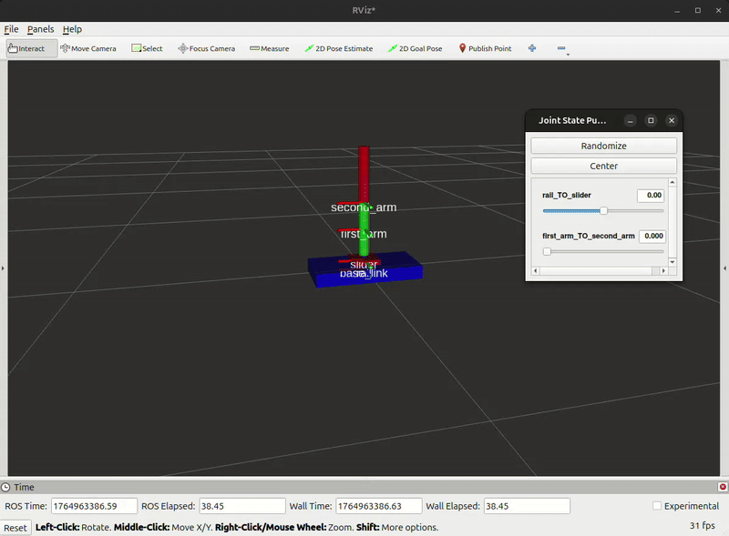
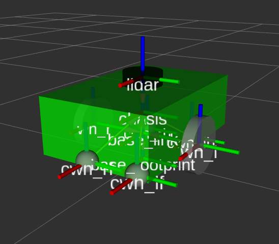

<h1>Uygulamalar</h3>

**0. [Robotik Kol Modeli](#hid-0)**
**1. [Robot Modelinin Çıkarımı](#hid-1)**
**2. [Gazebo Launcher'ı Oluşturumu](#hid-2)**
**3. [Diferansiyel Sürüş Plugini Eklenmesi](#hid-3)**
**4. [Klavye Kontrol (teleop keyboard)](#hid-4)**
**5. [Lidar Sensörünün Eklenmesi](#hid-5)**
**6. [Odometri Plugini ve ROS2 Entegrasyonu](#hid-6)**
**7. [Dünya Ve Model Ekleme](#hid-7)**
**8. [Ev Modeli ve Dünyası Oluşturma](#hid-8)**
**9. ['slam_toolbox' İle Haritalama](#hid-9)**
**10. ['nav2' İle Haritalama Çalışması](#hid-10)**
**11. ['nav2' İle Basit Uygulama](#hid-11)**

---

<h1 id="hid-0">0. Robotik Kol Modeli </h1>

<div align="center">
    
</div>  

#### Adım 1:

Yukarıdaki görselde gözüken robot kol modelini çıkarınız.
<details>
    <summary>Çözümü görmek için tıklayın</summary>

```xml
<?xml version="1.0"?>

<robot name="robot_kol">

    <material name="red">
        <color rgba="1 0 0 1" />
    </material>

    <material name="green">
        <color rgba="0 1 0 1" />
    </material>

    <material name="blue">
        <color rgba="0 0 1 1" />
    </material>

    <link name="base_link">
    </link>

    <joint name="base_link_TO_rail" type="fixed">
        <parent link="base_link" />
        <child link="rail" />
        <origin xyz="0 0 0" rpy="0 0 0" />
    </joint>

    <link name="rail">
        <visual>
            <origin xyz="0 0 0" rpy="0 0 0" />
            <geometry>
                <box size="0.4 0.2 0.05" />
            </geometry>
            <material name="blue"/>
        </visual>
    </link>

    <joint name="rail_TO_slider" type="prismatic">
        <parent link="rail" />
        <child link="slider" />
        <origin xyz="0 0 0.035" rpy="0 0 0" />
        <axis xyz="1 0 0" />
        <limit lower="-0.175" upper="0.175" effort="100" velocity="100" />
    </joint>

    <link name="slider">
        <visual>
            <origin xyz="0 0 0" rpy="0 0 0" />
            <geometry>
                <box size="0.1 0.1 0.02" />
            </geometry>
            <material name="red"/>
        </visual>
    </link>

    <joint name="slider_TO_first_arm" type="fixed">
        <parent link="slider" />
        <child link="first_arm" />
        <origin xyz="0 0 0.12" rpy="0 0 0" />
    </joint>

    <link name="first_arm">
        <visual>
            <origin xyz="0 0 0" rpy="0 0 0" />
            <geometry>
                <cylinder radius="0.02" length="0.2" />    
            </geometry>
            <material name="green"/>
        </visual>
    </link>

    <joint name="first_arm_TO_second_arm" type="revolute">
        <parent link="first_arm" />
        <child link="second_arm" />
        <origin xyz="0 0 0.1" rpy="0 0 0" />
        <axis xyz="0 1 0" />
        <limit lower="0.0" upper="1.57" effort="100" velocity="100" />
    </joint>

    <link name="second_arm">
        <visual>
            <origin xyz="0 0 0.1" rpy="0 0 0" />
            <geometry>
                <cylinder radius="0.02" length="0.2" />    
            </geometry>
            <material name="red"/>
        </visual>
    </link>
</robot>
```
</details>

#### Adım 2:

<div align="center">
    
</div>  

Yaptığınız robot kola, görselde gözüktüğü gibi bir adet tutucu ekleyin (resources klasörünün altında gripper.stl mesh'ini kullanabilirsiniz.)

<details>
    <summary>Çözümü görmek için tıklayın</summary>

```xml
<?xml version="1.0"?>

<robot name="robot_kol">

    <material name="red">
        <color rgba="1 0 0 1" />
    </material>

    <material name="green">
        <color rgba="0 1 0 1" />
    </material>

    <material name="blue">
        <color rgba="0 0 1 1" />
    </material>

    <material name="yellow">
        <color rgba="1 1 0 1" />
    </material>

    <link name="base_link">
    </link>

    <joint name="base_link_TO_rail" type="fixed">
        <parent link="base_link" />
        <child link="rail" />
        <origin xyz="0 0 0" rpy="0 0 0" />
    </joint>

    <link name="rail">
        <visual>
            <origin xyz="0 0 0" rpy="0 0 0" />
            <geometry>
                <box size="0.4 0.2 0.05" />
            </geometry>
            <material name="blue"/>
        </visual>
    </link>

    <joint name="rail_TO_slider" type="prismatic">
        <parent link="rail" />
        <child link="slider" />
        <origin xyz="0 0 0.035" rpy="0 0 0" />
        <axis xyz="1 0 0" />
        <limit lower="-0.175" upper="0.175" effort="100" velocity="100" />
    </joint>

    <link name="slider">
        <visual>
            <origin xyz="0 0 0" rpy="0 0 0" />
            <geometry>
                <box size="0.1 0.1 0.02" />
            </geometry>
            <material name="red"/>
        </visual>
    </link>

    <joint name="slider_TO_first_arm" type="fixed">
        <parent link="slider" />
        <child link="first_arm" />
        <origin xyz="0 0 0.12" rpy="0 0 0" />
    </joint>

    <link name="first_arm">
        <visual>
            <origin xyz="0 0 0" rpy="0 0 0" />
            <geometry>
                <cylinder radius="0.02" length="0.2" />    
            </geometry>
            <material name="green"/>
        </visual>
    </link>

    <joint name="first_arm_TO_second_arm" type="revolute">
        <parent link="first_arm" />
        <child link="second_arm" />
        <origin xyz="0 0 0.1" rpy="0 0 0" />
        <axis xyz="0 1 0" />
        <limit lower="0.0" upper="1.57" effort="100" velocity="100" />
    </joint>

    <link name="second_arm">
        <visual>
            <origin xyz="0 0 0.1" rpy="0 0 0" />
            <geometry>
                <cylinder radius="0.02" length="0.2" />    
            </geometry>
            <material name="red"/>
        </visual>
    </link>

    <joint name="second_arm_TO_gripper" type="fixed">
        <parent link="second_arm" />
        <child link="gripper" />
        <origin xyz="0 0 0.2" rpy="0 0 0" />
    </joint>

    <link name="gripper">
    </link>

    <joint name="gripper_TO_gripper_right" type="revolute">
        <parent link="gripper" />
        <child link="gripper_right" />
        <origin xyz="0 0 0" rpy="0 0 0" />
        <axis xyz="-1 0 0" />
        <limit lower="0.0" upper="0.7" effort="100" velocity="100" />
    </joint>

    <link name="gripper_right">
        <visual>
            <origin xyz="0.015 -0.00 0.06" rpy="0 -1.57 0" />
            <geometry>
                <mesh filename="file:///home/meren/Projects/btkamr_edu/alistirma/gripper.stl" scale="0.005 0.005 0.005"/>
            </geometry>
            <material name="yellow"/>
        </visual>
    </link>

    <joint name="gripper_TO_gripper_left" type="revolute">
        <parent link="gripper" />
        <child link="gripper_left" />
        <origin xyz="0 0 0" rpy="0 0 0" />
        <axis xyz="1 0 0" />
        <limit lower="0.0" upper="0.7" effort="100" velocity="100" />
    </joint>

    <link name="gripper_left">
        <visual>
            <origin xyz="-0.015 0.00 0.06" rpy="0 -1.57 3.1415" />
            <geometry>
                <mesh filename="file:///home/meren/Projects/btkamr_edu/alistirma/gripper.stl" scale="0.005 0.005 0.005"/>
            </geometry>
            <material name="yellow"/>
        </visual>
    </link>


</robot>
```

</details>


<h1 id="hid-1">1. Robot Modelinin Çıkarımı </h1>

<div align="center">
    
</div>  


Diferansiyel sürüşe uygun bir robot tasarlayın. İstediğiniz şekilde olabilir. Yeterki diferansiyel sürüş dinamiğine uygun olsun.

>* Workspace oluşturun 
>* İçine modelini taşıyacak bir paket açın
>* Paketin içine modelinizi oluşturun
>* Ayrıca modeli kontrol etmek için basit bir launch file oluşturun

<details>
    <summary>Çözümü görmek için tıklayın</summary>  

<br/>

Workspace oluşturun (Eğer yoksa)

```bash
mkdir btkamr_ws
mkdir btkamr_ws/src
```

Robot modeli için paket oluşturun

```bash
cd btkamr_ws/src
ros2 pkg create btkamr_description
```

Gereksiz klasörleri silebilirisiniz

```bash
rm -rf btkamr_description/src btkamr_description/include 
```

Paketin içine robot modelini ve launcherları taşıyacak klasörleri oluşturun

```bash
mkdir btkamr_description/urdf btkamr_description/launch
```

Şimdi Visual Studio Code'da çalışabiliriz.

Workspace dizinine gelelim ve Visual Studio Code'u başlatalım.

```bash
cd ..
code .
```

`CMakeList.txt` dosyasını düzenleyelim. Bundan sonra `urdf` ve `launch` klasörlerini de `share` dizinine taşısın.

```cmake
# ament_package() satırının hemen üstüne yapıştıralım

install(
    DIRECTORY urdf launch
    DESTINATION share/${PROJECT_NAME}/
)
```

Artık modeli oluşturmaya geçelim.

`urdf` klasörünün içine `main.urdf.xacro` isminde bir dosya oluşturalım.

Temel bir başlangıç yapalım.

```xml
<?xml version="1.0"?>

<robot xmlns:xacro="http://www.ros.org/wiki/xacro" name="btkamr">

    <link name="base_link"/>

</robot>
```

Renkleri ekleyelim.
```xml
<material name="red">
    <color rgba="1 0 0 1"/>
</material>

<material name="green">
    <color rgba="0 1 0 1"/>
</material>

<material name="blue">
    <color rgba="0 0 1 1"/>
</material>

<material name="gray">
    <color rgba="0.7 0.7 0.7 1"/>
</material>
```

Şasemizi ekleyelim

```xml
<xacro:property name="chasis_len_x" value="0.6"/>
<xacro:property name="chasis_len_y" value="0.4"/>
<xacro:property name="chasis_len_z" value="0.2"/>
<xacro:property name="base_chasis_offset" value="0.08"/>
<xacro:property name="chasis_mass" value="2.0"/>

<joint name="base_TO_chasis" type="fixed">
    <origin xyz="0.0 0.0 ${base_chasis_offset}" rpy="0.0 0.0 0.0"/>
    <parent link="base_link"/>
    <child link="chasis"/>
</joint>

<link name="chasis">
    <inertial>
        <mass value="${chasis_mass}"/>
        <inertia 
            ixx="${chasis_mass * (chasis_len_y * chasis_len_y + chasis_len_z * chasis_len_z) / 12.0}"
            iyy="${chasis_mass * (chasis_len_x * chasis_len_x + chasis_len_z * chasis_len_z) / 12.0}"
            izz="${chasis_mass * (chasis_len_x * chasis_len_x + chasis_len_y * chasis_len_y) / 12.0}"
            ixy="0" ixz="0" iyz="0"
        />
    </inertial>

    <visual>
        <geometry>
            <box size="${chasis_len_x} ${chasis_len_y} ${chasis_len_z}"/>
        </geometry>
        <material name="green"/>
    </visual>

    <collision>
        <geometry><box size="${chasis_len_x} ${chasis_len_y} ${chasis_len_z}"/></geometry>
    </collision>
</link>

```


Tahrik tekerleri için bir makro oluşturalım

```xml
<xacro:property name="wh_radius" value="0.1"/>
<xacro:property name="wh_thick" value="0.04"/>
<xacro:property name="wh_chasis_gap" value="0.001"/>
<xacro:property name="wh_mass" value="1.0"/>


<xacro:macro name="create_wh" params="postfix yfact">

    <joint name="base_TO_wh_${postfix}" type="continuous">
        <origin xyz="0.0 ${yfact * (chasis_len_y / 2.0 + wh_thick / 2.0 + wh_chasis_gap)} 0.0" rpy="0.0 0.0 0.0"/>
        <parent link="base_link"/>
        <child link="wh_${postfix}"/>
        <axis xyz="0.0 1.0 0.0"/>
    </joint>

    <link name="wh_${postfix}">
        <inertial>
            <origin xyz="0.0 0.0 0.0" rpy="${pi / 2.0} 0.0 0.0"/>

            <mass value="${wh_mass}"/>
            <inertia 
                ixx="${wh_mass * (3*wh_radius*wh_radius + wh_thick*wh_thick) / 12.0}"
                iyy="${wh_mass * (3*wh_radius*wh_radius + wh_thick*wh_thick) / 12.0}"
                izz="${wh_mass * (wh_radius*wh_radius) / 2.0}"
                ixy="0" ixz="0" iyz="0"
            />
        </inertial>

        <visual>
            <origin xyz="0.0 0.0 0.0" rpy="${pi / 2.0} 0.0 0.0"/>
            <geometry>
                <cylinder radius="${wh_radius}" length="${wh_thick}"/>
            </geometry>
            <material name="gray"/>
        </visual>

        <collision>
            <origin xyz="0.0 0.0 0.0" rpy="${pi / 2.0} 0.0 0.0"/>
            <geometry>
                <cylinder 
                    radius="${wh_radius}" 
                    length="${wh_thick}"/>
            </geometry>
        </collision>
    </link>

</xacro:macro>

```

Bu makroları kullanalım

``` xml
<xacro:create_wh postfix="l" yfact="1.0"/>
<xacro:create_wh postfix="r" yfact="-1.0"/>
```

Şimdi de avare tekerler için makro oluşturalım

```xml
<xacro:property name="cwh_chasis_offset_xy" value="0.1"/>
<!-- yarı çapı diğer niteliklere göre ayarlayalım -->
<xacro:property name="cwh_radius" value="${(wh_radius - (chasis_len_z / 2.0 - base_chasis_offset)) / 2.0}"/>
<xacro:property name="cwh_mass" value="0.00001"/>


<xacro:macro name="create_cwh" params="postfix xfact yfact">

    <!-- Yaw joint: x ekseni etrafında dönme -->
    <joint name="chasis_TO_cwh_${postfix}" type="fixed">
        <origin xyz="${xfact * (chasis_len_x / 2.0 - cwh_chasis_offset_xy)} 
                    ${yfact * (chasis_len_y / 2.0 - cwh_chasis_offset_xy)} 
                    ${-1 * (chasis_len_z / 2.0 + cwh_radius)}" rpy="0 0 0"/>
        <parent link="chasis"/>
        <child link="cwh_${postfix}"/>
    </joint>

    <!-- BALL CASTER LINK -->
    <link name="cwh_${postfix}">

        <!-- Çok hafif top (dönüşlerde robotu tutmaması için) -->
        <inertial>
            <mass value="0.01"/>
            <origin xyz="0 0 0"/>
            <inertia
                ixx="1e-5" ixy="0" ixz="0"
                iyy="1e-5" iyz="0"
                izz="1e-5"/>
        </inertial>

        <!-- Görsel -->
        <visual>
            <origin xyz="0 0 0" rpy="0 0 0"/>
            <geometry>
                <sphere radius="${cwh_radius}"/>
            </geometry>
            <material name="gray"/>
        </visual>

        <!-- Çarpışma ve sürtünme ayarları -->
        <collision>
            <origin xyz="0 0 0" rpy="0 0 0"/>
            <geometry>
                <sphere radius="${cwh_radius}"/>
            </geometry>
            <material name="gray"/>
        </collision>
    </link>

    <!-- gazebo için sürtünme değerlerini azaltıyoruz -->
    <gazebo reference="cwh_${postfix}">
        <collision>
            <surface>
                <friction>
                    <ode>
                        <mu>0.001</mu>    <!-- temel sürtünme -->
                        <mu2>0.001</mu2>  <!-- ikinci eksen sürtünmesi -->
                        <slip1>1.0</slip1>
                        <slip2>1.0</slip2>
                    </ode>
                </friction>
                <bounce>
                    <restitution_coefficient>0.0</restitution_coefficient>
                </bounce>
            </surface>
        </collision>
    </gazebo>

</xacro:macro>
```

Bu makroyu kullanalım

```xml
<xacro:create_cwh postfix="lf" xfact="1.0" yfact="1.0"/>
<xacro:create_cwh postfix="lb" xfact="-1.0" yfact="1.0"/>
<xacro:create_cwh postfix="rf" xfact="1.0" yfact="-1.0"/>
<xacro:create_cwh postfix="rb" xfact="-1.0" yfact="-1.0"/>
```

<br/>
<br/>
<br/>

Artık herşeyi yaptık. İsteğinize göre urdf kodlarını konumlandırıp `main.urdf.xacro` dosyasında include ederek kullanabilirsiniz.  

> Örneğin tekerler ile ilgili olan kodlar `wheels.urdf.xacro` isimli bir dosyada, şasi başka bir dosyada ve en son hepsi `main.urdf.xacro` dosyasında include edilerek kullanılabilir.  

Sonuç olarak şu şekilde toplam kodu şu şekilde özetleyebiliriz

`wheels.urdf.xacro`: 

```xml
<?xml version="1.0"?>

<robot xmlns:xacro="http://www.ros.org/wiki/xacro" name="btkamr">

    <!-- Tahrik Teker Nitelikleri  -->

    <xacro:property name="wh_radius" value="0.1"/>
    <xacro:property name="wh_thick" value="0.04"/>
    <xacro:property name="wh_chasis_gap" value="0.001"/>
    <xacro:property name="wh_mass" value="1.0"/>


    <!-- Avare Teker Nitelikleri -->

    <xacro:property name="cwh_chasis_offset_xy" value="0.1"/>
    <!-- yarı çapı diğer niteliklere göre ayarlayalım -->
    <xacro:property name="cwh_radius" value="${(wh_radius - (chasis_len_z / 2.0 - base_chasis_offset)) / 2.0}"/>
    <xacro:property name="cwh_mass" value="0.00001"/>


    <!-- Tahrik Tekerleği Makrosu -->
    <xacro:macro name="create_wh" params="postfix yfact">

        <joint name="base_TO_wh_${postfix}" type="continuous">
            <origin xyz="0.0 ${yfact * (chasis_len_y / 2.0 + wh_thick / 2.0 + wh_chasis_gap)} 0.0" rpy="0.0 0.0 0.0"/>
            <parent link="base_link"/>
            <child link="wh_${postfix}"/>
            <axis xyz="0.0 1.0 0.0"/>
        </joint>

        <link name="wh_${postfix}">
            <inertial>
                <origin xyz="0.0 0.0 0.0" rpy="${pi / 2.0} 0.0 0.0"/>

                <mass value="${wh_mass}"/>
                <inertia 
                    ixx="${wh_mass * (3*wh_radius*wh_radius + wh_thick*wh_thick) / 12.0}"
                    iyy="${wh_mass * (3*wh_radius*wh_radius + wh_thick*wh_thick) / 12.0}"
                    izz="${wh_mass * (wh_radius*wh_radius) / 2.0}"
                    ixy="0" ixz="0" iyz="0"
                />
            </inertial>

            <visual>
                <origin xyz="0.0 0.0 0.0" rpy="${pi / 2.0} 0.0 0.0"/>
                <geometry>
                    <cylinder radius="${wh_radius}" length="${wh_thick}"/>
                </geometry>
                <material name="gray"/>
            </visual>

            <collision>
                <origin xyz="0.0 0.0 0.0" rpy="${pi / 2.0} 0.0 0.0"/>
                <geometry>
                    <cylinder 
                        radius="${wh_radius}" 
                        length="${wh_thick}"/>
                </geometry>
            </collision>
        </link>

    </xacro:macro>


    <!-- Tahrik Tekerlekleri Oluşturumu -->

    <xacro:create_wh postfix="l" yfact="1.0"/> <!-- sol -->
    <xacro:create_wh postfix="r" yfact="-1.0"/> <!-- sağ -->


    <!-- Avare Teker Makrosu -->

    <xacro:macro name="create_cwh" params="postfix xfact yfact">

        <!-- Yaw joint: x ekseni etrafında dönme -->
        <joint name="chasis_TO_cwh_${postfix}" type="fixed">
            <origin xyz="${xfact * (chasis_len_x / 2.0 - cwh_chasis_offset_xy)} 
                        ${yfact * (chasis_len_y / 2.0 - cwh_chasis_offset_xy)} 
                        ${-1 * (chasis_len_z / 2.0 + cwh_radius)}" rpy="0 0 0"/>
            <parent link="chasis"/>
            <child link="cwh_${postfix}"/>
        </joint>

        <!-- BALL CASTER LINK -->
        <link name="cwh_${postfix}">

            <!-- Çok hafif top (dönüşlerde robotu tutmaması için) -->
            <inertial>
                <mass value="0.01"/>
                <origin xyz="0 0 0"/>
                <inertia
                    ixx="1e-5" ixy="0" ixz="0"
                    iyy="1e-5" iyz="0"
                    izz="1e-5"/>
            </inertial>

            <!-- Görsel -->
            <visual>
                <origin xyz="0 0 0" rpy="0 0 0"/>
                <geometry>
                    <sphere radius="${cwh_radius}"/>
                </geometry>
                <material name="gray"/>
                  
            </visual>

            <!-- Çarpışma ve sürtünme ayarları -->
            <collision>
                <origin xyz="0 0 0" rpy="0 0 0"/>
                <geometry>
                    <sphere radius="${cwh_radius}"/>
                </geometry>
            </collision>
        </link>

        <!-- gazebo için sürtünme değerlerini azaltıyoruz -->
        <gazebo reference="cwh_${postfix}">
            <collision>
                <surface>
                    <friction>
                        <ode>
                            <mu>0.001</mu>    <!-- temel sürtünme -->
                            <mu2>0.001</mu2>  <!-- ikinci eksen sürtünmesi -->
                            <slip1>1.0</slip1>
                            <slip2>1.0</slip2>
                        </ode>
                    </friction>
                    <bounce>
                        <restitution_coefficient>0.0</restitution_coefficient>
                    </bounce>
                </surface>
            </collision>
        </gazebo>

    </xacro:macro>


    <!-- Avare Tekerlerin Kullanımı -->

    <xacro:create_cwh postfix="lf" xfact="1.0" yfact="1.0"/>
    <xacro:create_cwh postfix="lb" xfact="-1.0" yfact="1.0"/>
    <xacro:create_cwh postfix="rf" xfact="1.0" yfact="-1.0"/>
    <xacro:create_cwh postfix="rb" xfact="-1.0" yfact="-1.0"/>

</robot>
```

`main.urdf.xacro`:

```xml
<?xml version="1.0"?>

<robot xmlns:xacro="http://www.ros.org/wiki/xacro" name="btkamr">

    <!-- Renk Tanımlamaları -->
    <material name="red">
        <color rgba="1 0 0 1"/>
    </material>

    <material name="green">
        <color rgba="0 1 0 1"/>
    </material>

    <material name="blue">
        <color rgba="0 0 1 1"/>
    </material>

    <material name="gray">
        <color rgba="0.7 0.7 0.7 1"/>
    </material>


    <!-- Şase Nitelikleri -->

    <xacro:property name="chasis_len_x" value="0.6"/>
    <xacro:property name="chasis_len_y" value="0.4"/>
    <xacro:property name="chasis_len_z" value="0.2"/>
    <xacro:property name="base_chasis_offset" value="0.08"/>
    <xacro:property name="chasis_mass" value="2.0"/>


    <!-- Dosyaları Dahil Etme -->
    
    <xacro:include filename="./wheels.urdf.xacro" />
    <xacro:include filename="./g_plugins.xacro" />


    <!-- Base Link -->

    <link name="base_footprint"/>
    
    <link name="base_link"/>

    <joint name="base_TO_footprint" type="fixed">
        <origin xyz="0.0 0.0 ${wh_radius}" rpy="0.0 0.0 0.0"/>
        <parent link="base_footprint"/>
        <child link="base_link"/>
    </joint>


    <!-- Şase Oluşturumu -->

    <joint name="base_TO_chasis" type="fixed">
        <origin xyz="0.0 0.0 ${base_chasis_offset}" rpy="0.0 0.0 0.0"/>
        <parent link="base_link"/>
        <child link="chasis"/>
    </joint>

    <link name="chasis">
        <inertial>
            <mass value="${chasis_mass}"/>
            <inertia 
                ixx="${chasis_mass * (chasis_len_y * chasis_len_y + chasis_len_z * chasis_len_z) / 12.0}"
                iyy="${chasis_mass * (chasis_len_x * chasis_len_x + chasis_len_z * chasis_len_z) / 12.0}"
                izz="${chasis_mass * (chasis_len_x * chasis_len_x + chasis_len_y * chasis_len_y) / 12.0}"
                ixy="0" ixz="0" iyz="0"
            />
        </inertial>

        <visual>
            <geometry><box size="${chasis_len_x} ${chasis_len_y} ${chasis_len_z}"/></geometry>
        </visual>

        <collision>
            <geometry><box size="${chasis_len_x} ${chasis_len_y} ${chasis_len_z}"/></geometry>
        </collision>
    </link>

</robot>
```
<br/>
<br/>
<br/>

Şimdi robot modelimizi oluşturduğumuza göre artık RViz'de görüntüleyelim. Bunun için bir launch dosyası yazalım.

`launch` klasörünün altına `display.launch.py` isminde bir python betiği oluşturalım.

```python
import os
from ament_index_python.packages import get_package_share_directory
from launch import LaunchDescription
from launch.substitutions import Command
from launch_ros.actions import Node
from launch_ros.parameter_descriptions import ParameterValue

PKG_NAME: str = "btkamr_description"

def generate_launch_description():
    pkg_share = get_package_share_directory(PKG_NAME)
    urdf_path = os.path.join(pkg_share, "urdf", "main.urdf.xacro")
    robot_desc = ParameterValue(Command(["xacro ", urdf_path]), value_type=str) # boşluk önemli xacro' '

    return LaunchDescription([
        Node(
            package="robot_state_publisher",
            executable="robot_state_publisher",
            parameters=[{"robot_description": robot_desc}]
        ),
        Node(
            package="joint_state_publisher_gui",
            executable="joint_state_publisher_gui"
        ),
        Node(
            package="rviz2",
            executable="rviz2"
        ),
    ])
```

Artık build edelim

```bash
# workspace dizininde olduğumuzdan emin olalım
colcon build
```

Çalıştıralım

```bash
# workspace dizininde olduğumuzdan emin olalım
source install/setup.bash
ros2 launch btkamr_description display.launch.py
```

Bir hata görünüyorsa düzeltelim ve adımları tekrarlayalım.

Uygulama 1 tamamlanmıştır.

</details>

<h1 id="hid-2">2. Gazebo Launcher'ı Oluşturumu </h1>

Gazebo'yu başlatacak ve robotu spawn edecek bir launcher ayarlayın. Robot'un RViz'de doğru göründüğünden emin olun.

* gazebo.launch.py dosyası oluştur
* gazeboyu başlat
* robotu gazeboda spawn et
* plugin ekle joint state pbulisher
* köprü yaml dosyası yaz
* köprüyü çalıştır

</details>

<details> 
    <summary>
        Çözümü görmek için tıklayın.
    </summary>

Önceki launch dosyamızı kopyalayıp yapıştıralım. İsmini ise `gazebo.launch.py` olarak değiştirelim.

```python
import os
from ament_index_python.packages import get_package_share_directory
from launch import LaunchDescription
from launch.substitutions import Command
from launch_ros.actions import Node
from launch_ros.parameter_descriptions import ParameterValue

PKG_NAME: str = "btkamr_description"

def generate_launch_description():
    pkg_share = get_package_share_directory(PKG_NAME)
    urdf_path = os.path.join(pkg_share, "urdf", "main.urdf.xacro")
    robot_desc = ParameterValue(Command(["xacro ", urdf_path]), value_type=str) # boşluk önemli xacro' '

    return LaunchDescription([
        Node(
            package="robot_state_publisher",
            executable="robot_state_publisher",
            parameters=[{"robot_description": robot_desc}]
        ),
        Node(
            package="joint_state_publisher_gui",
            executable="joint_state_publisher_gui"
        ),
        Node(
            package="rviz2",
            executable="rviz2"
        ),
    ])
```

`joint_state_publisher_gui` düğümünü başlatan kodu silelim. Çünkü artık joint durumlarını biz belirlemeyeceğiz simülasyonda ne ise onu kabul edeceğiz.

Launch dosyamızdan şu kod bloğunu çıkarıyoruz:

```python
Node(
    package="joint_state_publisher_gui",
    executable="joint_state_publisher_gui"
),
```

<br/>

Şimdi bizden istenenleri yapmaya başlayabiliriz.

Gazeboyu başlatmamız lazım. Bunun için `ros_gz_sim` paketinin `gz_sim.launch.py` ismindeki launcher'ını kullanabiliriz.

Launch dosyamızın import bölümüne şunu ekleyelim.

```python
from launch.actions import IncludeLaunchDescription
from launch.launch_description_sources import PythonLaunchDescriptionSource
```
<br/>

Launch dosyamızın diğer düğümleri başlattığımız yere şunu ekleyelim.

```python
IncludeLaunchDescription(
    PythonLaunchDescriptionSource(
        os.path.join(
            get_package_share_directory('ros_gz_sim'),
            'launch',
            'gz_sim.launch.py'
        )
    ),
    launch_arguments={
        'gz_args': ['-r -v 4 ', "empty.sdf"] #cli'dan çalışırken de verebileceğimiz argümanlar
    }.items()
),
```

<br/>

Şimdi bir test edelim. Bir sıkıntı yoksa devam edelim.

Robotumuzu simülasyonda spawn etmemiz gerekiyor. Bunun için `ros_gz_sim` paketinin `create` executable'ını kullanabiliriz.

Launch dosyamıza şunu ekleyelim.

```python
Node(
    package='ros_gz_sim',
    executable='create',
    parameters=[{'topic': 'robot_description'}],
),
```
<br/>

Şimdi bir test edelim. Bir sıkıntı yoksa devam edelim.

Joint state publisher plugin'i eklememiz gerekiyor. 

`urdf` klasörümüze, `g_plugins.urdf.xacro` isminde bir dosya açalım. Bundan sonra pluginlerimizi bu dosyada ekleyeceğiz.

Bu dosyanın içeriğini oluşturalım:

```xml
<?xml version="1.0"?>

<robot xmlns:xacro="http://www.ros.org/wiki/xacro" name="btkamr">

    <gazebo>
        <plugin 
            filename="gz-sim-joint-state-publisher-system"
            name="gz::sim::systems::JointStatePublisher"
        >
            <!-- Tüm jointlerin yayımlanmasını istediğimizden joint_name belirtmedik -->
            
            <!-- Yayınlanacak topic ismi -->
            <topic>btkamr/joint_states</topic>
        </plugin>  
    </gazebo>

</robot>
```

<br/>

Bu dosyayı `main.urdf.xacro` dosyamızda `include` edelim.

```xml
<xacro:include filename="./g_plugins.urdf.xacro" />
```

<br/>

Şimdi bir daha test edelim. Launcher'ımızı çalıştırdıktan sonra terminalimizden Gazebo topic'lerini kontrol edelim

```bash
gz topic -l
```

Eğer `/btkamr/joint_states` isminde bir çıktı göremiyorsak bir şeyleri yanlış yapmışız demektir. Yoksa devam edelim.

Artık Gazebo joint durumlarını `/btkamr/joint_states` topic'inden yayımlıyor. Ancak bizim buna ROS2 tarafında ihtiyacımız var. O yüzden bir köprü oluşturmamız lazım.

Bunun için `ros_gz_bridge` paketinin `parameter_bridge` executable'ını kullanabiliriz. Bunun için de önce bir konfigürasyon dosyası oluşturalım.

`config` isminde bir klasör açalım. Bu klasörü de `CMakeList.txt` dosyasında share klasörüne taşınması için ayarlama yapalım.

`config` klasörünün içine `gz_bridge.yaml` isminde bir dosya açalım ve içine şunu yazalım.

```yaml
# - ros_topic_name: "<ROS tarafındaki topic ismi>"
#   gz_topic_name: "<Gazebo tarafındaki topic ismi>"
#   ros_type_name: "<verinin ROS tarafındaki tipi>"
#   gz_type_name: "<verinin Gazebo tarafındaki tipi>"
#   direction: <köprünün yönü>

- ros_topic_name: "joint_states"
  gz_topic_name: "btkamr/joint_states"
  ros_type_name: "sensor_msgs/msg/JointState"
  gz_type_name: "gz.msgs.Model"
  direction: GZ_TO_ROS 
```

<br/>

Launcher'da bu dosyayı referans vererek köprüyü başlatalım.

Dosyanın yolunu bulup bir değişkene atalım.

```python
gz_bridge_cfg_file = os.path.join(
    get_package_share_directory(),
    "config",
    "gz_bridge.yaml"
)
```

<br/>

Şu düğümü de başlatalım

```python
Node(
    package='ros_gz_bridge',
    executable='parameter_bridge',
    parameters=[{'config_file': gz_bridge_cfg_file}],
),
```

<br/>

Şimdi test edelim. RViz'de robot modeli görünümünde herhangi bir sıkıntı yoksa köprümüz doğru çalışıyordur.


Dosyaların son halleri:

`gazebo.launch.py`


</details>

<h1 id="hid-3">3. Diferansiyel Sürüş Plugininin Eklenmesi</h1>

Robotunuzun URDF dosyasına diferansiyel sürüş plugini ekleyin ve Gazebo'da test edin

<details> 
    <summary>
        Çözümü görmek için tıklayın.
    </summary>

`g_plugins.urdf.xacro` dosyasında `gazebo` etiketleri arasına şu plugini de ekleyelim.

```xml
<plugin
    filename="gz-sim-diff-drive-system"
    name="gz::sim::systems::DiffDrive"
>

    <!-- Hız emirlerinin alınacağı topic -->
    <topic>btkamr/cmd_vel</topic>

    <!-- Sol teker jointi -->
    <left_joint>base_TO_wh_l</left_joint>
    
    <!-- Sağ teker jointi -->
    <right_joint>base_TO_wh_r</right_joint>

    <!-- Tahrik tekerlekleri arasındaki mesafe -->
    <!-- Bir tekerin, base_link'e olan uzaklığının iki katı -->
    <wheel_separation>${(chasis_len_y / 2.0 + wh_thick / 2.0 + wh_chasis_gap) * 2}</wheel_separation>

    <!-- Teker yarıçapı -->
    <wheel_radius>${wh_radius}</wheel_radius>

</plugin>
```

<br/>

Test için Gazebo'dan Teleop'u açalım kontrol edelim.

Eğer doğru çalıştıysa bunun için de bir köprü ekleyelim

`gz_bridge.yaml` dosyasına şunu ekleyelim

```yaml
- ros_topic_name: "cmd_vel"
  gz_topic_name: "btkamr/cmd_vel"
  ros_type_name: "geometry_msgs/msg/Twist"
  gz_type_name: "gz.msgs.Twist"
  direction: ROS_TO_GZ
```

Çalıştıralım ve sonrasında ros2 mesajı göndererek kontrol edelim

```bash
ros2 topic pub /cmd_vel geometry_msgs/msg/Twist \
"{linear: {x: 0.5, y: 0.0, z: 0.0}, angular: {x: 0.0, y: 0.0, z: 0.3}}"
```

Sola doğru eğik hareket ediyor olması lazım.
Bir çember çizmeli.

Uygulama tamamlanmıştır.

</details>

<h1 id="hid-4">4. Klavye Kontrol (teleop)</h1>

Robotunuzu, ROS2 ile yazılmış bir klavye kontrol düğümü ile hızını kontrol edin.

* Klavyeden W,A,S,D veya yön tuşlarını okuyun
* Bu tuşların karşılıklarına göre `cmd_vel` topic'ine mesaj gönderin.

---

* Bir python paketi oluşturun ismi `btkamr_tools` 
* Bir tane betik oluşturun ismi de `teleop_keyboard.py`


<details> 
    <summary>
        Çözümü görmek için tıklayın.
    </summary>
<br/>

Bir tane python paketi oluşturalım `btkamr_tools` isminde. 

```bash
cd app_ws/src
ros2 pkg create btkamr_tools --build-type ament_python
```
<br/>

Şimdi bir betik oluşturalım (`teleop_keyboard.py`). İçeriğine ise kontrol düğümümüzü yazalım

```python
#!/usr/bin/env python3
import sys
import termios
import tty
import select

import rclpy
from rclpy.node import Node
from geometry_msgs.msg import Twist


HELP = """
WASD Teleop
-----------------
  w : ileri
  s : geri
  a : sola dön
  d : sağa dön
  boşluk : dur
  q : çıkış
"""

def get_key(timeout=0.1):
    """Terminalden non-blocking tek karakter okur"""
    rlist, _, _ = select.select([sys.stdin], [], [], timeout)
    if rlist:
        return sys.stdin.read(1)
    return None


class TeleopWASD(Node):
    def __init__(self):
        super().__init__("teleop_wasd")

        self.pub = self.create_publisher(Twist, "cmd_vel", 10)

        # Parametreler (launch veya CLI'dan değiştirilebilir)
        self.declare_parameter("lin_speed", 0.5)   # m/s
        self.declare_parameter("ang_speed", 0.5)    # rad/s
        self.declare_parameter("rate", 20.0)         # Hz

        self.lin_speed = self.get_parameter("lin_speed").value
        self.ang_speed = self.get_parameter("ang_speed").value
        rate = self.get_parameter("rate").value

        self.twist = Twist()
        self.timer = self.create_timer(1.0 / rate, self.loop)

        self.get_logger().info(HELP)

    def loop(self):
        key = get_key(0.01)
        if key:
            key = key.lower()

            if key == "w":
                self.twist.linear.x = self.lin_speed
                self.twist.angular.z = 0.0
            elif key == "s":
                self.twist.linear.x = -self.lin_speed
                self.twist.angular.z = 0.0
            elif key == "a":
                self.twist.linear.x = 0.0
                self.twist.angular.z = self.ang_speed
            elif key == "d":
                self.twist.linear.x = 0.0
                self.twist.angular.z = -self.ang_speed
            elif key == " ":
                self.twist = Twist()
            elif key == "q":
                self.shutdown()

        self.pub.publish(self.twist)

    def shutdown(self):
        self.get_logger().info("Teleop kapatılıyor, robot durduruluyor.")
        self.pub.publish(Twist())
        rclpy.shutdown()


def main():
    # terminal ayarlarını sakla
    old_settings = termios.tcgetattr(sys.stdin)
    tty.setcbreak(sys.stdin.fileno())

    rclpy.init()
    node = TeleopWASD()

    try:
        rclpy.spin(node)
    finally:
        node.pub.publish(Twist())
        termios.tcsetattr(sys.stdin, termios.TCSADRAIN, old_settings)


if __name__ == "__main__":
    main()
```


paketimizin `setup.py` dosyasına, düğümümüzü çalıştıracak bir giriş noktası ekleyelim

```python
entry_points={
    'console_scripts': [
        # Aşağıdaki satırı ekleyelim
        "teleop_keyboard = btkamr_tools.teleop_keyboard:main"
    ],
},
```

Artık çalıştırıp test edebiliriz. (build etmeyi ve source`lamayı unutmayın)

```bash
ros2 run btkamr_tools teleop_keyboard
```


</details>

<br/>

<h1 id="hid-5">5. LiDAR Sensörünün Eklenmesi</h1>

Robotunuza bir LiDAR sensörü ekleyin ve RViz'de görüntüleyin

* `urdf` klasörünüze bir `sensor_extensions.urdf.xacro` isminde bir urdf dosyası açın.
* Bu dosyada LiDAR için bir link ve onu `chasis` linkine bağlayacak joint oluşturun.
* Genel sensör pluginini ekleyin.
* Eklediğiniz LiDAR link'ini Gazebo'ya sensör olarak tanıtın.
* Lidar için köprü kurun.
* RViz'de gözlemlemek için `LaserScan` isimli plugini ekleyin *(program üzerinden)*.

<details> 
    <summary>
        Çözümü görmek için tıklayın.
    </summary>

<br/>

`btkamr_description` paketinizde `urdf` klasörünüze bir `sensor_extensions.urdf.xacro` isminde bir urdf dosyası açın.

Önce lidarı fiziksel olarak oluşturalım.

```xml
<?xml version="1.0"?>

<robot xmlns:xacro="http://www.ros.org/wiki/xacro" name="btkamr">

    <xacro:property name="lidar_radius" value="0.05" />
    <xacro:property name="lidar_length" value="0.02" />

    <joint name="chasis_TO_lidar" type="fixed">
        <parent link="chasis" />
        <child link="lidar" />
        <origin xyz="0 0 ${chasis_len_z / 2.0 + lidar_length / 2.0}" rpy="0 0 0" />
    </joint>

    <link name="lidar">
        <visual>
            <geometry>
                <cylinder radius="${lidar_radius}" length="${lidar_length}"/>
            </geometry>
            <material name="black"/>
        </visual>

        <collision>
            <geometry>
                <cylinder radius="${lidar_radius}" length="${lidar_length}"/>
            </geometry>
        </collision>
    </link>

</robot>
```
<br/>

Genel sensör pluginini ekleyelim.

```xml
<gazebo>
	<!-- Genel sensör sistemi: Tüm sensörlerin temel çalışma altyapısını sağlar -->
	<plugin filename="gz-sim-sensors-system"
			name="gz::sim::systems::Sensors">

		<!-- Kamera ve GPU lidar gibi sensörler için render motoru.
			Ogre2 çoğu modern simülasyon için önerilir. -->
		<render_engine>ogre2</render_engine>
	</plugin>  
</gazebo>
```
<br/>

Eklediğimiz LiDAR link'ini Gazebo'ya sensör olarak tanıtalım.

```xml
<gazebo reference="lidar">
	<sensor name="gpu_lidar" type="gpu_lidar">
		<!-- Sensörün modele göre konumu -->
		<pose>0 0 0 0 0 0</pose>

		<!-- Yayınlanacak Gazebo topic adı -->
		<topic>lidar/scan</topic>

		<!-- Saniyede 10 kez ölçüm üret -->
		<update_rate>10</update_rate>

		<!-- GPU tabanlı ray sensor yapılandırması -->
		<ray>
			<scan>
			<horizontal>
				<!-- Kaç adet ışın gönderileceği -->
				<samples>640</samples>

				<!-- Işın çözünürlüğü (1 = birebir, 2 = her 2 ışında 1 hesaplama) -->
				<resolution>1</resolution>

				<!-- Taramanın sol sınırı -->
				<min_angle>-1.57</min_angle>

				<!-- Taramanın sağ sınırı -->
				<max_angle>1.57</max_angle>
			</horizontal>
			</scan>

			<!-- Mesafe ölçüm parametreleri -->
			<range>
			<!-- Sensörün minimum algılama mesafesi -->
			<min>0.08</min>

			<!-- Maksimum algılama mesafesi -->
			<max>15.0</max>

			<!-- Mesafe çözünürlüğü -->
			<resolution>0.01</resolution>
			</range>
		</ray>

		<!-- Veriyi kaydedilebilir hâle getirmek için -->
		<always_on>true</always_on>

		<!-- Gazebo GUI’de lazer tarama çizgilerini göster -->
		<visualize>true</visualize>

		<gz_frame_id>lidar</gz_frame_id> 
	</sensor>

</gazebo>
```
<br/>

Evet `sensor_extensions.urdf.xacro` dosyası ile işimiz bitti. Son hali:

```xml
<?xml version="1.0"?>

<robot xmlns:xacro="http://www.ros.org/wiki/xacro" name="btkamr">

    <xacro:property name="lidar_radius" value="0.05" />
    <xacro:property name="lidar_length" value="0.02" />

    <link name="lidar">
        <visual>
            <geometry>
                <cylinder radius="${lidar_radius}" length="${lidar_length}"/>
            </geometry>
            <material name="black"/>
        </visual>

        <collision>
            <geometry>
                <cylinder radius="${lidar_radius}" length="${lidar_length}"/>
            </geometry>
        </collision>
    </link>

    <joint name="chasis_TO_lidar" type="fixed">
        <parent link="chasis" />
        <child link="lidar" />
        <origin xyz="0 0 ${chasis_len_z / 2.0 + lidar_length / 2.0}" rpy="0 0 0" />
    </joint>

    <gazebo>
        <!-- Genel sensör sistemi: Tüm sensörlerin temel çalışma altyapısını sağlar -->
        <plugin filename="gz-sim-sensors-system"
                name="gz::sim::systems::Sensors">

            <!-- Kamera ve GPU lidar gibi sensörler için render motoru.
                Ogre2 çoğu modern simülasyon için önerilir. -->
            <render_engine>ogre2</render_engine>
        </plugin>  
    </gazebo>

    <gazebo reference="lidar">
        <sensor name="gpu_lidar" type="gpu_lidar">
            <!-- Sensörün modele göre konumu -->
            <pose>0 0 0 0 0 0</pose>

            <!-- Yayınlanacak Gazebo topic adı -->
            <topic>lidar/scan</topic>

            <!-- Saniyede 10 kez ölçüm üret -->
            <update_rate>10</update_rate>

            <!-- GPU tabanlı ray sensor yapılandırması -->
            <ray>
                <scan>
                <horizontal>
                    <!-- Kaç adet ışın gönderileceği -->
                    <samples>640</samples>

                    <!-- Işın çözünürlüğü (1 = birebir, 2 = her 2 ışında 1 hesaplama) -->
                    <resolution>1</resolution>

                    <!-- Taramanın sol sınırı -->
                    <min_angle>-1.57</min_angle>

                    <!-- Taramanın sağ sınırı -->
                    <max_angle>1.57</max_angle>
                </horizontal>
                </scan>

                <!-- Mesafe ölçüm parametreleri -->
                <range>
                <!-- Sensörün minimum algılama mesafesi -->
                <min>0.08</min>

                <!-- Maksimum algılama mesafesi -->
                <max>15.0</max>

                <!-- Mesafe çözünürlüğü -->
                <resolution>0.01</resolution>
                </range>
            </ray>

            <!-- Veriyi kaydedilebilir hâle getirmek için -->
            <always_on>true</always_on>

            <!-- Gazebo GUI’de lazer tarama çizgilerini göster -->
            <visualize>true</visualize>

            <gz_frame_id>lidar</gz_frame_id> 
        </sensor>
    
    </gazebo>

</robot>
```
<br/>

`config` klasörünün içinde `gz_bridge.yaml` dosyamıza şu satırları ekleyelim.

```yaml
- ros_topic_name: "lidar/scan"
  gz_topic_name: "lidar/scan"
  ros_type_name: "sensor_msgs/msg/LaserScan"
  gz_type_name: "gz.msgs.LaserScan"
  direction: GZ_TO_ROS
```

Çalıştırıken RViz'de şu eklentiyi aktif edelim.

<div align="center">
    
</div>  

Uygulama tamamlanmıştır simülasyonda robotunuzun yakınına cisim ekleyerek lidarınızı kontrol edebilirsiniz.

</details>


<h1 id="hid-6">6. Odometri Plugini ve ROS2 Entegrasyonu</h1>

Robotunuzun URDF'ine bir odometry publisher plugini ekleyin ve RViz'de gözlemleyin.

* `g_plugins.urdf.xacro` dosyasına odometry publisher plugini ekleyin.

* `gz_bridge.yaml` dosyasına odometry mesajı için köprü ekleyin

* Odometri'yi frame olarak da göstermek için bir düğüm oluşturun. Bu düğüm odometri mesajlarına abone olsun ve bunları transformlara dönüştürsün.

<details> 
    <summary>
        Çözümü görmek için tıklayın.
    </summary>

    ayıp :(

</details>

<h1 id="hid-7">7. Dünya Ve Model Ekleme</h1>


Kendimize ait bir model ve dünya oluşturalım.

* simülasyon için bir paket açın `btkamr_simulate`

* simülasyona ait şeyleri `btkamr_description` paketinden kaldırın ve bu pakete ekleyin

* `worlds` ve `models` isminde klasör oluşturun.

* `CMakeLists.txt` dosyasını düzenleyin, bu klasörlerin de `share` klasörüne taşınmasını sağlayın.

* `models` klasörünün içine `my_model` isminde bir model oluşturun.

* `worlds` klasörünün içinde `my_world.sdf` isminde bir dünya oluşturun. 

* Oluşturduğunuz dünyada, oluşturduğunuz modeli kullanın.

* Launch dosyanızı düzenleyin.

* Çalıştırıp deneyimleyin.

<details> 
    <summary>
        Çözümü görmek için tıklayın.
    </summary>

Paketi oluşturalım

```bash
cd app_ws/src
ros2 pkg create btkamr_simulate
```

<br/>

launch, config, worlds ve models klasörlerini açalım. include, launch klasörlerini silelim

```bash
cd btkamr_simulate
rm -rf include src
mkdir launch config worlds models
```
<br/>

`CMakeList.txt` dosyasını şunu ekleyelim.

```cmake
install(
    DIRECTORY launch config worlds models
    DESTINATION share/${PROJECT_NAME}/
)
```
<br/>

`my_model` isminde bir model oluşturalım.

* `models` klasörünün içine girelim.
* `my_model` isminde bir klasör oluşturup içine girelim
* burada `model.sdf` ve `model.config` isminde iki tane dosya oluşturalım 

```bash
cd models
mkdir my_model
cd my_model
touch model.sdf model.config
```
<br/>

`model.config` dosyasının içeriğini yazalım

```xml
<?xml version="1.0" ?>
<model>
    <name>my_model</name>
    <version>1.0</version>
    <sdf version="1.6">model.sdf</sdf>
    <author>
        <name>kendi_ismin</name>
        <email>kendi_mailin@gmail.com</email>
    </author>
    <description>
        Bu model benim modelim
    </description>
</model>
```
<br/>

`model.sdf` dosyasının içeriğini istediğiniz gibi doldurun

```xml
<?xml version="1.0" ?>
<sdf version="1.6">
  <model name="my_model">
    
    <link name="link">
      <!-- Görsel Tanımlama -->
      <visual name="visual">
        <geometry>
            <box size="3 3 3"/>
        </geometry>
        <material>
          <ambient>0 0 0 1</ambient>
          <diffuse>0 0 0 1</diffuse>
          <specular>0.1 0.1 0.1 1</specular>
          <emissive>0 0 0 1</emissive>
        </material>
      </visual>

      <collision name="collision">
        <geometry>
            <box size="3 3 3"/>
        </geometry>
      </collision>

      <!-- İnertial bilgileri -->
      <inertial>
        <mass>0.5</mass>
        <inertia>
          <ixx>0.005</ixx>
          <ixy>0</ixy>
          <ixz>0</ixz>
          <iyy>0.005</iyy>
          <iyz>0</iyz>
          <izz>0.005</izz>
        </inertia>
      </inertial>
      
    </link>
  </model>
</sdf>
```
<br/>

şimdi de bir dünya oluşturalım ve modelimizi koyalım. `worlds` klsaörünün içine `my_world.sdf` isimli bir dosya açalım. İçeriği ise şöyle olsun

```xml
<?xml version="1.0" ?>

<sdf version="1.6">
  <world name="my_world">
    <physics name="1ms" type="ignored">
      <max_step_size>0.001</max_step_size>
      <real_time_factor>1.0</real_time_factor>
    </physics>
    <plugin
      filename="gz-sim-physics-system"
      name="gz::sim::systems::Physics">
    </plugin>
    <plugin
      filename="gz-sim-user-commands-system"
      name="gz::sim::systems::UserCommands">
    </plugin>
    <plugin
      filename="gz-sim-scene-broadcaster-system"
      name="gz::sim::systems::SceneBroadcaster">
    </plugin>
    <plugin
      filename="gz-sim-contact-system"
      name="gz::sim::systems::Contact">
    </plugin>

    <light type="directional" name="sun">
      <cast_shadows>true</cast_shadows>
      <pose>0 0 10 0 0 0</pose>
      <diffuse>0.8 0.8 0.8 1</diffuse>
      <specular>0.2 0.2 0.2 1</specular>
      <attenuation>
        <range>1000</range>
        <constant>0.9</constant>
        <linear>0.01</linear>
        <quadratic>0.001</quadratic>
      </attenuation>
      <direction>-0.5 0.1 -0.9</direction>
    </light>

    <model name="ground_plane">
      <static>true</static>
      <link name="link">
        <collision name="collision">
          <geometry>
            <plane>
              <normal>0 0 1</normal>
              <size>100 100</size>
            </plane>
          </geometry>
        </collision>
        <visual name="visual">
          <geometry>
            <plane>
              <normal>0 0 1</normal>
              <size>100 100</size>
            </plane>
          </geometry>
          <material>
            <ambient>0.8 0.8 0.8 1</ambient>
            <diffuse>0.8 0.8 0.8 1</diffuse>
            <specular>0.8 0.8 0.8 1</specular>
          </material>
        </visual>
      </link>
    </model>

    <!-- Kendi modelimizi dahil edelim -->
    <include>
      <uri>models://my_model</uri>
      <name>my_model_instance_1</name>
      <pose>5 0 1.5 0 0 0</pose>
    </include>
  
  </world>
</sdf>
```
<br/>

Şimdi bir launcher oluşturalım ismi `my_world.launch.py` olsun

```python
import os
from ament_index_python.packages import get_package_share_directory
from launch import LaunchDescription
from launch.actions import IncludeLaunchDescription, SetEnvironmentVariable
from launch.substitutions import Command
from launch.launch_description_sources import PythonLaunchDescriptionSource
from launch_ros.actions import Node
from launch_ros.parameter_descriptions import ParameterValue


def generate_launch_description():
    
    # ============================================================================
    # Paket Yolları
    # ============================================================================
    pkg_share = get_package_share_directory("btkamr_simulate")
    desc_pkg_share = get_package_share_directory("btkamr_description")
    ros_gz_sim_pkg_share = get_package_share_directory("ros_gz_sim")
    
    config_dir = os.path.join(pkg_share, "config")
    worlds_dir = os.path.join(pkg_share, "worlds")
    
    # ============================================================================
    # Dosya Yolları 
    # ============================================================================
    models_path = os.path.join(pkg_share, "models")
    gz_bridge_config_path = os.path.join(config_dir, "gz_bridge.yaml")
    world_path = os.path.join(worlds_dir, "my_world.sdf")
    rviz_config_path = os.path.join(config_dir, "base.rviz")
    urdf_path = os.path.join(desc_pkg_share, "urdf", "main.urdf.xacro")
        
    # ============================================================================
    # Nodes ve Actions
    # ============================================================================
    # Robot description'ı xacro'dan oluştur
    robot_desc = ParameterValue(
        Command(["xacro ", urdf_path]), 
        value_type=str
    )
    


Burada özellikle şu kısmı unutum

    # Gazebo Simülasyonu
    gz_sim = IncludeLaunchDescription(
        PythonLaunchDescriptionSource(
            os.path.join(ros_gz_sim_pkg_share, "launch", "gz_sim.launch.py")
        ),
        launch_arguments={
            "gz_args": [
                "-v 4 ",            # Verbose level 4
                world_path
            ]
        }.items()
    )
    
    # Robot State Publisher
    robot_state_publisher = Node(
        package="robot_state_publisher",
        executable="robot_state_publisher",
        parameters=[{"robot_description": robot_desc}]
    )
    
    # Gazebo'da Robot Spawn
    spawn_robot = Node(
        package="ros_gz_sim",
        executable="create",
        output="screen",
        parameters=[{"topic": "robot_description"}]
    )
    
    # ROS-Gazebo Bridge
    ros_gz_bridge = Node(
        package="ros_gz_bridge",
        executable="parameter_bridge",
        parameters=[{"config_file": gz_bridge_config_path}]
    )
    
    # RViz (norviz=false ise)
    rviz = Node(
        package="rviz2",
        executable="rviz2",
        arguments=["-d", rviz_config_path],
    )
    
    # ============================================================================
    # Launch Description
    # ============================================================================
    return LaunchDescription([
        set_gz_resource_path_env,
        gz_sim,
        robot_state_publisher,
        spawn_robot,
        ros_gz_bridge,
        rviz
    ])
```

Burada özellikle Gazebonun kaynak yoluna kendi modellerinizin dizinini eklemeyi unutmayın

```python
# Gazebo resource pathi ayarla
#!!! Modellerimizi görsün diye

existing_resource_path = os.environ.get("GZ_SIM_RESOURCE_PATH", "")
if existing_resource_path:
    new_resource_path = models_path + ":" + existing_resource_path
else:
    new_resource_path = models_path

set_gz_resource_path_env = SetEnvironmentVariable(
    name = "GZ_SIM_RESOURCE_PATH",
    value = new_resource_path
)
```

Çalıştırın ve hem dünyanızı hem modelinizi test edin.

</details>


<h1 id="hid-8">8. Bir Ev Modeli ve Dünyası Oluşturma</h1>

Yeni bir Gazebo modeli oluşturun ismi `my_house` olsun. Bu modeli bir evin sahip olacağı türden duvarlar olarak oluşturun. Bir tane de `in_my_house.sdf` isminde dünya oluşturun. Bu dünyada `my_house` modelini dahil edin ve bir kaç şekil ekleyin.

<details>
    <summary>
        Çözümü görmek için tıklayın.
    </summary>


`btkamr_simulate` paketinin içindeki `models` klasörünün altına yeni bir model oluşturalım. (koalylık için önceki modeli kopyalayıp yapıştırın ve ismini değiştirin)

`my_house.sdf` için örnek kod

```xml
<?xml version="1.0" ?>
<sdf version="1.6">
  <model name="my_house">

    <!-- Sabit olsun sürüklenmesin -->
    <static>true</static>

    <link name="link">

      <!-- wall_1 -->
      <collision name="wall_1_collision">
        <pose>-2.0 2.0 1.0 0 0 0</pose>
        <geometry>
          <box><size>0.1 8.0 2.0</size></box>
        </geometry>
      </collision>
      <visual name="wall_1">
        <pose>-2.0 2.0 1.0 0 0 0</pose>
        <geometry>
          <box><size>0.1 8.0 2.0</size></box>
        </geometry>
        <material>
          <ambient>0.55 0.27 0.07 1</ambient>
          <diffuse>0.55 0.27 0.07 1</diffuse>
          <specular>0.1 0.1 0.1 1</specular>
          <emissive>0 0 0 1</emissive>
        </material>
      </visual>

      <!-- wall_2 -->
      <collision name="wall_2_collision">
        <pose>1.5 6.0 1.0 0 0 -1.57</pose>
        <geometry>
          <box><size>0.1 7.0 2.0</size></box>
        </geometry>
      </collision>
      <visual name="wall_2">
        <pose>1.5 6.0 1.0 0 0 -1.57</pose>
        <geometry>
          <box><size>0.1 7.0 2.0</size></box>
        </geometry>
        <material>
          <ambient>0.55 0.27 0.07 1</ambient>
          <diffuse>0.55 0.27 0.07 1</diffuse>
          <specular>0.1 0.1 0.1 1</specular>
          <emissive>0 0 0 1</emissive>
        </material>
      </visual>

      <!-- wall_3 -->
      <collision name="wall_3_collision">
        <pose>5.0 4.0 1.0 0 0 0</pose>
        <geometry>
          <box><size>0.1 4.0 2.0</size></box>
        </geometry>
      </collision>
      <visual name="wall_3">
        <pose>5.0 4.0 1.0 0 0 0</pose>
        <geometry>
          <box><size>0.1 4.0 2.0</size></box>
        </geometry>
        <material>
          <ambient>0.55 0.27 0.07 1</ambient>
          <diffuse>0.55 0.27 0.07 1</diffuse>
          <specular>0.1 0.1 0.1 1</specular>
          <emissive>0 0 0 1</emissive>
        </material>
      </visual>

      <!-- wall_4 -->
      <collision name="wall_4_collision">
        <pose>3.5 2.0 1.0 0 0 -1.57</pose>
        <geometry>
          <box><size>0.1 3.0 2.0</size></box>
        </geometry>
      </collision>
      <visual name="wall_4">
        <pose>3.5 2.0 1.0 0 0 -1.57</pose>
        <geometry>
          <box><size>0.1 3.0 2.0</size></box>
        </geometry>
        <material>
          <ambient>0.55 0.27 0.07 1</ambient>
          <diffuse>0.55 0.27 0.07 1</diffuse>
          <specular>0.1 0.1 0.1 1</specular>
          <emissive>0 0 0 1</emissive>
        </material>
      </visual>

      <!-- wall_5 -->
      <collision name="wall_5_collision">
        <pose>2.0 1.25 1.0 0 0 0</pose>
        <geometry>
          <box><size>0.1 1.5 2.0</size></box>
        </geometry>
      </collision>
      <visual name="wall_5">
        <pose>2.0 1.25 1.0 0 0 0</pose>
        <geometry>
          <box><size>0.1 1.5 2.0</size></box>
        </geometry>
        <material>
          <ambient>0.55 0.27 0.07 1</ambient>
          <diffuse>0.55 0.27 0.07 1</diffuse>
          <specular>0.1 0.1 0.1 1</specular>
          <emissive>0 0 0 1</emissive>
        </material>
      </visual>

      <!-- wall_6 -->
      <collision name="wall_6_collision">
        <pose>2.0 -1.25 1.0 0 0 0</pose>
        <geometry>
          <box><size>0.1 1.5 2.0</size></box>
        </geometry>
      </collision>
      <visual name="wall_6">
        <pose>2.0 -1.25 1.0 0 0 0</pose>
        <geometry>
          <box><size>0.1 1.5 2.0</size></box>
        </geometry>
        <material>
          <ambient>0.55 0.27 0.07 1</ambient>
          <diffuse>0.55 0.27 0.07 1</diffuse>
          <specular>0.1 0.1 0.1 1</specular>
          <emissive>0 0 0 1</emissive>
        </material>
      </visual>

      <!-- wall_7 -->
      <collision name="wall_7_collision">
        <pose>0 -2.0 1.0 0 0 -1.57</pose>
        <geometry>
          <box><size>0.1 4 2.0</size></box>
        </geometry>
      </collision>
      <visual name="wall_7">
        <pose>0 -2.0 1.0 0 0 -1.57</pose>
        <geometry>
          <box><size>0.1 4 2.0</size></box>
        </geometry>
        <material>
          <ambient>0.55 0.27 0.07 1</ambient>
          <diffuse>0.55 0.27 0.07 1</diffuse>
          <specular>0.1 0.1 0.1 1</specular>
          <emissive>0 0 0 1</emissive>
        </material>
      </visual>

      <!-- wall_8 -->
      <collision name="wall_8_collision">
        <pose>5.0 -1.5 1.0 0 0 0</pose>
        <geometry>
          <box><size>0.1 7 2.0</size></box>
        </geometry>
      </collision>
      <visual name="wall_8">
        <pose>5.0 -1.5 1.0 0 0 0</pose>
        <geometry>
          <box><size>0.1 7 2.0</size></box>
        </geometry>
        <material>
          <ambient>0.55 0.27 0.07 1</ambient>
          <diffuse>0.55 0.27 0.07 1</diffuse>
          <specular>0.1 0.1 0.1 1</specular>
          <emissive>0 0 0 1</emissive>
        </material>
      </visual>

      <!-- wall_9 -->
      <collision name="wall_9_collision">
        <pose>1.5 -5.0 1.0 0 0 -1.57</pose>
        <geometry>
          <box><size>0.1 7 2.0</size></box>
        </geometry>
      </collision>
      <visual name="wall_9">
        <pose>1.5 -5.0 1.0 0 0 -1.57</pose>
        <geometry>
          <box><size>0.1 7 2.0</size></box>
        </geometry>
        <material>
          <ambient>0.55 0.27 0.07 1</ambient>
          <diffuse>0.55 0.27 0.07 1</diffuse>
          <specular>0.1 0.1 0.1 1</specular>
          <emissive>0 0 0 1</emissive>
        </material>
      </visual>

      <!-- wall_10 -->
      <collision name="wall_10_collision">
        <pose>-2.0 -3.5 1.0 0 0 0</pose>
        <geometry>
          <box><size>0.1 3 2.0</size></box>
        </geometry>
      </collision>
      <visual name="wall_10">
        <pose>-2.0 -3.5 1.0 0 0 0</pose>
        <geometry>
          <box><size>0.1 3 2.0</size></box>
        </geometry>
        <material>
          <ambient>0.55 0.27 0.07 1</ambient>
          <diffuse>0.55 0.27 0.07 1</diffuse>
          <specular>0.1 0.1 0.1 1</specular>
          <emissive>0 0 0 1</emissive>
        </material>
      </visual>

      <!-- Inertia Rastgele -->
      <inertial>
        <mass>1000</mass>
        <inertia>
          <ixx>0.005</ixx>
          <iyy>0.005</iyy>
          <izz>0.005</izz>
          <ixy>0</ixy>
          <ixz>0</ixz>
          <iyz>0</iyz>
        </inertia>
      </inertial>

    </link>
  </model>
</sdf>
```
<br/>

`worlds` klasörünün altına `in_my_house.sdf` isimli bir dosya açalım

Örnek `in_my_house.sdf` içeriği:

```xml
<?xml version="1.0" ?>

<sdf version="1.6">
  <world name="in_my_house">
    <physics name="1ms" type="ignored">
      <max_step_size>0.001</max_step_size>
      <real_time_factor>1.0</real_time_factor>
    </physics>
    <plugin
      filename="gz-sim-physics-system"
      name="gz::sim::systems::Physics">
    </plugin>
    <plugin
      filename="gz-sim-user-commands-system"
      name="gz::sim::systems::UserCommands">
    </plugin>
    <plugin
      filename="gz-sim-scene-broadcaster-system"
      name="gz::sim::systems::SceneBroadcaster">
    </plugin>
    <plugin
      filename="gz-sim-contact-system"
      name="gz::sim::systems::Contact">
    </plugin>

    <light type="directional" name="sun">
      <cast_shadows>true</cast_shadows>
      <pose>0 0 10 0 0 0</pose>
      <diffuse>0.8 0.8 0.8 1</diffuse>
      <specular>0.2 0.2 0.2 1</specular>
      <attenuation>
        <range>1000</range>
        <constant>0.9</constant>
        <linear>0.01</linear>
        <quadratic>0.001</quadratic>
      </attenuation>
      <direction>-0.5 0.1 -0.9</direction>
    </light>

    <model name="ground_plane">
      <static>true</static>
      <link name="link">
        <collision name="collision">
          <geometry>
            <plane>
              <normal>0 0 1</normal>
              <size>100 100</size>
            </plane>
          </geometry>
        </collision>
        <visual name="visual">
          <geometry>
            <plane>
              <normal>0 0 1</normal>
              <size>100 100</size>
            </plane>
          </geometry>
          <material>
            <ambient>0.8 0.8 0.8 1</ambient>
            <diffuse>0.8 0.8 0.8 1</diffuse>
            <specular>0.8 0.8 0.8 1</specular>
          </material>
        </visual>
      </link>
    </model>

    <!-- Evimizi ekliyoruz -->

    <include>
      <uri>models://my_house</uri>
      <name>my_house_0</name>
      <pose>0 0 0 0 0 0</pose>
    </include>


    <!-- Evin içine silindir ekliyoruz -->
    <model name='cylinder_0'>
      <pose>3.0750443933769169 3.9731146155776944 0.5 0 0 0</pose>
      <link name='cylinder_link'>
        <inertial>
          <inertia>
            <ixx>0.14580000000000001</ixx>
            <ixy>0</ixy>
            <ixz>0</ixz>
            <iyy>0.14580000000000001</iyy>
            <iyz>0</iyz>
            <izz>0.125</izz>
          </inertia>
          <mass>1</mass>
          <pose>0 0 0 0 0 0</pose>
        </inertial>
        <collision name='cylinder_collision'>
          <geometry>
            <cylinder>
              <radius>0.5</radius>
              <length>1</length>
            </cylinder>
          </geometry>
          <surface>
            <friction>
              <ode/>
            </friction>
            <bounce/>
            <contact/>
          </surface>
        </collision>
        <visual name='cylinder_visual'>
          <geometry>
            <cylinder>
              <radius>0.5</radius>
              <length>1</length>
            </cylinder>
          </geometry>
          <material>
            <ambient>0.300000012 0.300000012 0.300000012 1</ambient>
            <diffuse>0.699999988 0.699999988 0.699999988 1</diffuse>
            <specular>1 1 1 1</specular>
          </material>
        </visual>
      </link>
    </model>


    <!-- Evin içine silindir ekliyoruz -->
    <model name='cylinder_1'>
      <pose>-0.5953490688254921 4.0829731145354442 0.5 0 0 0</pose>
      <link name='cylinder_link'>
        <inertial>
          <inertia>
            <ixx>0.14580000000000001</ixx>
            <ixy>0</ixy>
            <ixz>0</ixz>
            <iyy>0.14580000000000001</iyy>
            <iyz>0</iyz>
            <izz>0.125</izz>
          </inertia>
          <mass>1</mass>
          <pose>0 0 0 0 0 0</pose>
        </inertial>
        <collision name='cylinder_collision'>
          <geometry>
            <cylinder>
              <radius>0.5</radius>
              <length>1</length>
            </cylinder>
          </geometry>
        </collision>
        <visual name='cylinder_visual'>
          <geometry>
            <cylinder>
              <radius>0.5</radius>
              <length>1</length>
            </cylinder>
          </geometry>
          <material>
            <ambient>0.300000012 0.300000012 0.300000012 1</ambient>
            <diffuse>0.699999988 0.699999988 0.699999988 1</diffuse>
            <specular>1 1 1 1</specular>
          </material>
        </visual>
        <pose>0 0 0 0 0 0</pose>
      </link>
    </model>

    <!-- Evin içine silindir ekliyoruz -->
    <model name='cylinder_2'>
      <pose>4.0674601233897523 -4.1347624700697931 0.5 0 0 0</pose>
      <link name='cylinder_link'>
        <inertial>
          <inertia>
            <ixx>0.14580000000000001</ixx>
            <ixy>0</ixy>
            <ixz>0</ixz>
            <iyy>0.14580000000000001</iyy>
            <iyz>0</iyz>
            <izz>0.125</izz>
          </inertia>
          <mass>1</mass>
          <pose>0 0 0 0 0 0</pose>
        </inertial>
        <collision name='cylinder_collision'>
          <geometry>
            <cylinder>
              <radius>0.5</radius>
              <length>1</length>
            </cylinder>
          </geometry>
          <surface>
            <friction>
              <ode/>
            </friction>
            <bounce/>
            <contact/>
          </surface>
        </collision>
        <visual name='cylinder_visual'>
          <geometry>
            <cylinder>
              <radius>0.5</radius>
              <length>1</length>
            </cylinder>
          </geometry>
          <material>
            <ambient>0.300000012 0.300000012 0.300000012 1</ambient>
            <diffuse>0.699999988 0.699999988 0.699999988 1</diffuse>
            <specular>1 1 1 1</specular>
          </material>
        </visual>
      </link>
    </model>

  </world>
</sdf>
```

Launcher'ınızda isim değişikliğine gidebilir ya da ayrı bir launcher oluşturabilirsiniz.

</details>

